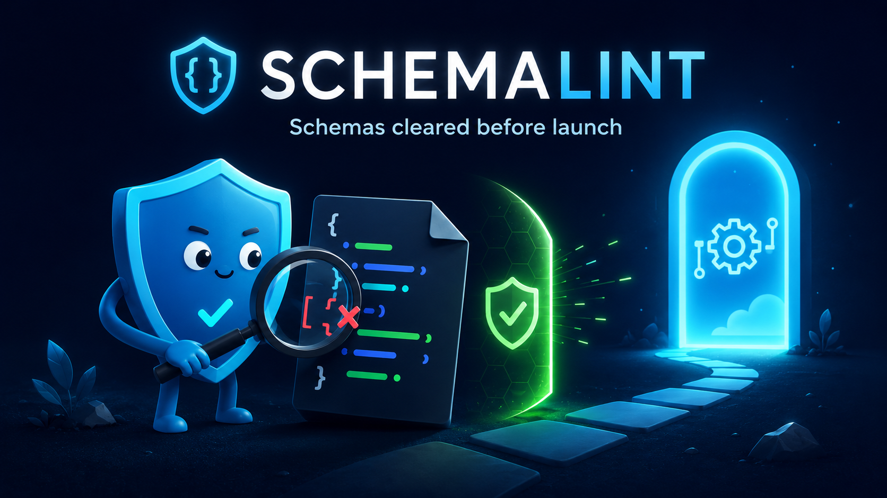

<p align="center">
  
</p>

<h1 align="center">schemalint</h1>

<p align="center">
  <b>Catch provider-incompatible schemas before OpenAI or Anthropic reject them at runtime.</b>
</p>

<p align="center">
  <a href="https://github.com/1nder-labs/schemalint/actions/workflows/ci.yml"></a>
  <a href="https://www.npmjs.com/package/@1nder-labs/schemalint"></a>
  <a href="https://crates.io/crates/schemalint"></a>
  <a href="https://docs.rs/schemalint"></a>
  <a href="https://github.com/1nder-labs/schemalint/blob/main/LICENSE-MIT"></a>
</p>

<p align="center">
  
</p>

OpenAI and Anthropic structured-output APIs accept only a strict subset of JSON Schema. Ship a schema with an unsupported keyword, a missing `required` entry, or the wrong `additionalProperties`, and the API rejects it — in production, at request time, as a `400`.

**schemalint catches those errors at build time**, checked against the exact provider rules, so a bad schema fails your CI instead of your users' requests.

## Install

```bash
# npm / bun — adds the `schemalint` command to your project
npm install -D @1nder-labs/schemalint

# Rust
cargo install schemalint

# Python
pip install schemalint
```

## Quick start

Check a schema against OpenAI's structured-output rules:

```bash
schemalint check --profile openai.so.2026-04-30 schema.json
```

```text
error[OAI-K-allOf]: keyword 'allOf' is not supported by openai.so.2026-04-30
  --> schema.json

1 issue found (1 error, 0 warnings) across 1 schema
```

Check a whole directory, for both providers at once:

```bash
schemalint check \
  --profile openai.so.2026-04-30 \
  --profile anthropic.so.2026-04-30 \
  schemas/
```

## Lint Zod and Pydantic directly

Schemas live in your code, not in `.json` files? schemalint reads them straight from your **Zod** or **Pydantic** definitions — no manual JSON Schema export, no second package to install.

```jsonc
// package.json
{
  "scripts": { "lint:schemas": "schemalint check-node" },
  "schemalint": {
    "profiles": ["openai.so.2026-04-30"],
    "include": ["src/**/*.ts"]
  }
}
```

```bash
npm run lint:schemas        # Zod  → check-node
schemalint check-python     # Pydantic → check-python
```

## What it catches

- Unsupported keywords (`allOf`, `oneOf`, `not`, unsupported `format`s, …) per provider
- Missing `required` entries and `additionalProperties: false` mistakes
- Invalid root shapes, unsupported `$ref` patterns, and enum / nesting limits
- Size and depth limits that otherwise only surface as a runtime `400`

## Providers

| Provider | Profile |
| --- | --- |
| OpenAI Structured Outputs | `openai.so.2026-04-30` |
| Anthropic Structured Outputs | `anthropic.so.2026-04-30` |

## In CI

schemalint exits non-zero on errors, so it fails the build before a broken schema ever ships:

```yaml
- run: npx schemalint check --profile openai.so.2026-04-30 schemas/
```

Pick the output format that fits your pipeline:

```bash
schemalint check --format json   --profile openai.so.2026-04-30 schema.json   # machine-readable
schemalint check --format sarif  --profile openai.so.2026-04-30 schema.json   # code scanning
schemalint check --format gha    --profile openai.so.2026-04-30 schema.json   # GitHub Actions annotations
```

| Exit code | Meaning |
| --- | --- |
| `0` | No errors |
| `1` | Schema, parse, or read errors |
| `2` | Could not write the output file |

## Documentation

- [Installation](https://1nder-labs.github.io/schemalint/guide/installation) · [Quick start](https://1nder-labs.github.io/schemalint/guide/quick-start)
- [OpenAI profile](https://1nder-labs.github.io/schemalint/profiles/openai) · [Anthropic profile](https://1nder-labs.github.io/schemalint/profiles/anthropic)
- [Rule reference](https://1nder-labs.github.io/schemalint/rules)

## Contributing

Bug reports, new rules, and provider profiles are all welcome — see [CONTRIBUTING.md](CONTRIBUTING.md) and [CODE_OF_CONDUCT.md](CODE_OF_CONDUCT.md).

## Security

Found a vulnerability? Please report it privately — see [SECURITY.md](SECURITY.md).

## License

Dual-licensed under [MIT](LICENSE-MIT) or [Apache-2.0](LICENSE-APACHE), at your option.
