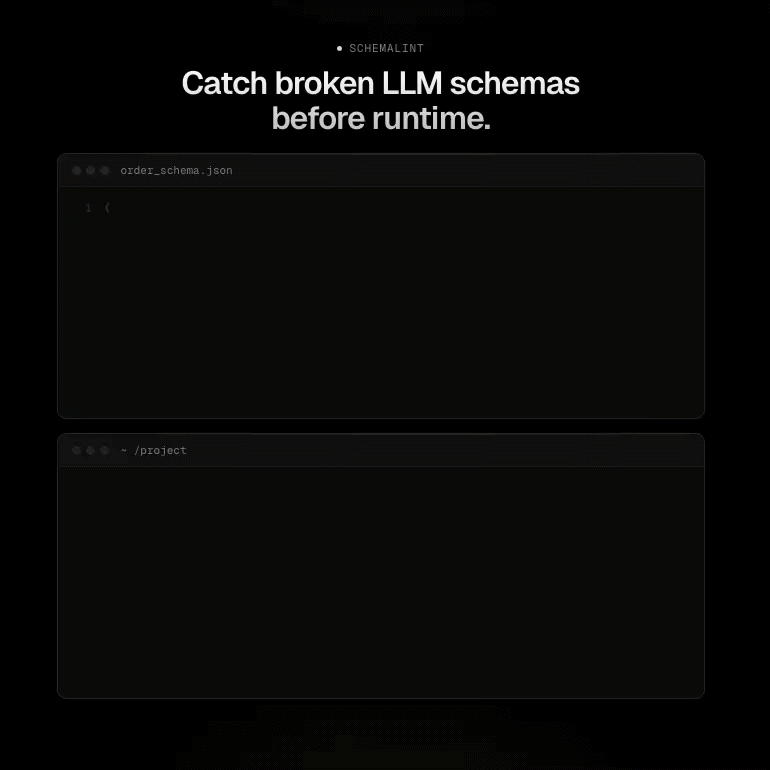

# schemalint



Static analysis tool for JSON Schema compatibility with LLM structured-output providers.

## What it does

`schemalint` checks JSON Schemas against provider capability profiles and tells you which keywords, types, or structural patterns the provider does not support. This catches schema incompatibilities **before** you send them to the LLM API.

Supported providers (Phase 1):
- **OpenAI Structured Outputs** — via the built-in `openai.so.2026-04-30.toml` profile

## Installation

```bash
cargo install schemalint
```

## Quick start

```bash
# Lint a single schema against the OpenAI profile
schemalint check \
  --profile crates/schemalint-profiles/profiles/openai.so.2026-04-30.toml \
  schema.json

# Lint all schemas in a directory
schemalint check \
  --profile openai.so.2026-04-30.toml \
  ./schemas/

# Output structured JSON instead of human-readable diagnostics
schemalint check \
  --profile openai.so.2026-04-30.toml \
  --format json \
  schema.json
```

## Human output format

```text
error[OAI-K-allOf]: keyword 'allOf' is not supported by openai.so.2026-04-30
   --> schema.json
     |
     = profile: openai.so.2026-04-30
     = schema path: /
     = see: https://schemalint.dev/rules/OAI-K-allOf

1 issue found (1 error, 0 warnings) across 1 schema
```

## JSON output format

```json
{
  "schema_version": "1.0",
  "tool": {
    "name": "schemalint",
    "version": "0.1.0"
  },
  "profiles": ["openai.so.2026-04-30"],
  "summary": {
    "total_issues": 1,
    "errors": 1,
    "warnings": 0,
    "schemas_checked": 1
  },
  "diagnostics": [
    {
      "code": "OAI-K-allOf",
      "severity": "error",
      "message": "keyword 'allOf' is not supported by openai.so.2026-04-30",
      "schemaPath": "/",
      "filePath": "schema.json",
      "profile": "openai.so.2026-04-30",
      "seeUrl": "https://schemalint.dev/rules/OAI-K-allOf"
    }
  ]
}
```

## Exit codes

| Code | Meaning |
|------|---------|
| `0` | No errors (warnings alone are OK) |
| `1` | At least one error-level diagnostic, or a fatal parse/IO error |

## Capabilities (Phase 1)

- **Class A keyword rules** — auto-generated from the profile. For example, if the profile marks `allOf` as `forbid`, any schema containing `allOf` produces `OAI-K-allOf`.
- **Class B structural rules** — data-driven from the `[structural]` TOML section. Checks root type, `additionalProperties: false`, required-field completeness, nesting depth, total property count, enum cardinality, string-length budgets, and external `$ref` usage.
- **Value restrictions** — restricted keywords (e.g., `format` limited to `date-time`, `email`, `uuid`) emit `OAI-K-<keyword>-restricted` when a disallowed value is used.
- **In-memory cache** — identical schemas within a single CLI invocation are normalized only once via content-hash caching.
- **Parallel processing** — schema files are processed in parallel with `rayon`.

## Limitations (Phase 1)

- Only **OpenAI** profile included. Anthropic profile and multi-profile composition are planned for Phase 2.
- Only **human** and **JSON** output. SARIF, GitHub Actions annotations, and JUnit XML are planned for Phase 2.
- Only **JSON Schema files** (`.json`) are accepted. Pydantic and Zod ingestion helpers are planned for Phases 3 and 4.
- **No source spans** (line:col) for raw `.json` files because `serde_json` does not provide byte offsets. Source spans will be available via language-specific ingestion in Phases 3+.
- **No disk cache** — in-memory only within a single CLI invocation. Persistent cache is planned for Phase 2 server mode.
- **No auto-fix** — out of scope for v1.

## Performance targets

Measured on Apple M3 (or equivalent 2-core CI runner):

| Scenario | Target | Actual |
|----------|--------|--------|
| Single 200-property schema | < 1 ms | ~330 µs |
| 500 schemas, cold start | < 500 ms | ~5.1 ms |
| 500 schemas, incremental (cache hit) | < 5 ms | ~640 µs |

## Project structure

```
crates/
├── schemalint/          # Core engine + CLI
│   ├── src/cli/         # Argument parsing, file discovery, output formatters
│   ├── src/ir/          # Arena-allocated IR (Node, NodeId, Arena)
│   ├── src/normalize/   # Normalizer pipeline (dialect, refs, Tarjan SCC, desugar)
│   ├── src/profile/     # TOML profile loader
│   ├── src/rules/       # Rule trait, registry, Class A + Class B rules
│   ├── tests/           # 87 tests across 10 test files
│   └── benches/         # Criterion benchmarks
└── schemalint-profiles/ # Built-in provider profiles
    └── profiles/
        └── openai.so.2026-04-30.toml
```

## License

MIT OR Apache-2.0
