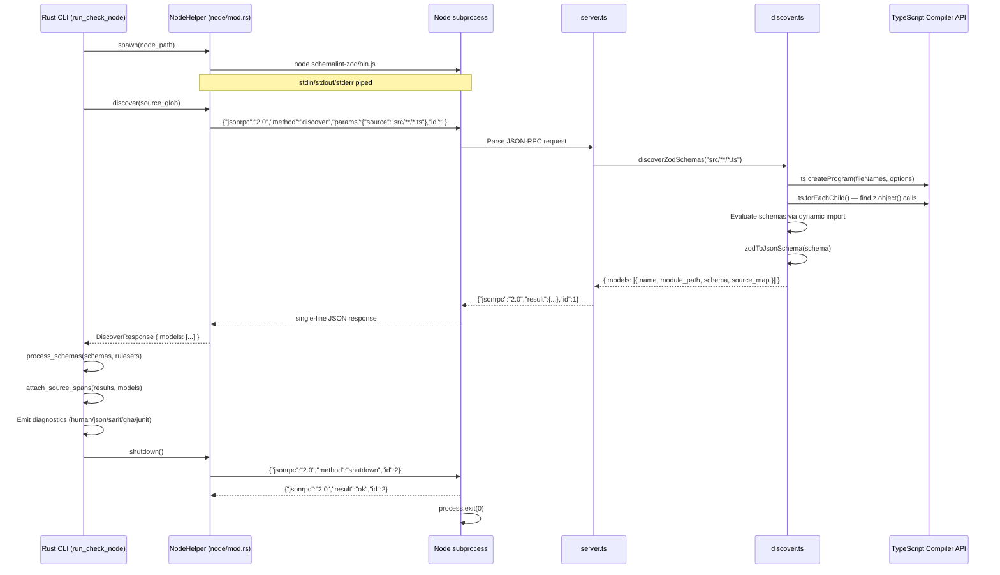

# feat: Add Zod ingestion with TypeScript source-span attribution

## Summary

Mirror Phase 3's Pydantic ingestion architecture for the TypeScript/Zod ecosystem: a TypeScript helper package that discovers Zod schemas via AST walking + runtime evaluation, a Rust-side subprocess manager, and CLI integration that feeds discovered schemas through the existing normalization and rule-checking pipeline. Diagnostics land on TypeScript source lines.

---

## Problem Frame

Phase 3 gave Python/Pydantic developers first-class source-span attribution. Phase 4 extends the same capability to TypeScript/Zod developers — the other primary schema-authoring language. Without it, Zod users must manually export JSON Schema files, run `schemalint check`, and mentally map diagnostics back to `.ts` source. The architecture mirrors Phase 3 exactly (JSON-RPC over stdin/stdout, single subprocess), with one fundamental difference: Zod schemas are runtime values discovered via AST walking, not class-introspection. See origin document for full problem frame and actors.

---

## Requirements

**Origin document:** `docs/brainstorms/phase4-requirements.md` (R1–R11, A1–A4, F1–F3, AE1–AE6)

**Origin actors:** A1 (TypeScript developer), A2 (Rust CLI), A3 (Node helper), A4 (Programmatic consumer)

**Origin flows:** F1 (Batch check via CLI), F2 (package.json-driven check), F3 (Programmatic API call)

**Origin acceptance examples:** AE1 (e2e check-node with source span), AE2 (nested object spans), AE3 (CLI-overrides-config), AE4 (Node not installed error), AE5 (Programmatic lint), AE6 (ESM + path aliases)

**Helper package**
- R1. `schemalint-zod` npm-installable TypeScript package with minimal deps
- R2. JSON-RPC 2.0 server over stdin/stdout (discover + shutdown)
- R3. Discover: AST-walk for `z.object()` calls, runtime evaluation, `zod-to-json-schema` conversion, source map

**Source spans**
- R4. Each property in `z.object({...})` resolves to correct file:line from AST; nested objects recursively mapped; graceful fallback for composed schemas

**Process management**
- R5. Rust CLI manages single Node subprocess with timeout, clear errors
- R6. Existing normalize → check → emit pipeline reused unchanged

**Diagnostic propagation**
- R7. Source spans survive pipeline and land on diagnostics across all 5 output formats

**CLI**
- R8. `check-node` subcommand with `--source`, `--config`, `--profile`, `--node-path`, `--format`, `--output`
- R9. `"schemalint"` field in `package.json` with `profiles`, `include`, `exclude`, `severity`

**Programmatic API**
- R10. `lint(schemas[], options)` function in `@schemalint/zod`, delegates to `schemalint server` subprocess

**Compatibility**
- R11. ESM + CJS support; tsconfig.json path aliases; basic monorepo workspace support

---

## Scope Boundaries

- Process pool — single subprocess is sufficient for batch mode. Multi-process deferred.
- napi-rs self-containment for `lint()` — Phase 4 requires `schemalint` CLI on PATH; native bindings in Phase 5.
- Non-Zod TypeScript schema libraries (valibot, arktype, typebox) — Zod only in v1.
- Schemas from imported factory functions or function-returned schemas — not discoverable via AST walking.
- Auto-detection from import graph — requires explicit `--source` or config `include` patterns.
- IDE / LSP integration — `schemalint server` remains JSON-Schema-only for Phase 4.
- Bun and Deno runtimes — Node.js only.
- Full monorepo tooling integration (turborepo, nx) — basic workspace support only.
- Package distribution to npm — Phase 5.

### Deferred to Follow-Up Work

- Generalized `NodeHelper` support in `schemalint server` mode (streaming re-discovery for Zod sources) — separate PR.
- Automatic `tsx`/`ts-node` detection vs pre-compiled JS fallback in helper spawn logic — implementation can consolidate during Phase 5 packaging work.

---

## Context & Research

### Relevant Code and Patterns

The entire Phase 3 implementation is the reference pattern. Key files to mirror:

- `crates/schemalint/src/python/mod.rs:1-353` — `PythonHelper` struct, `spawn()`, `discover()`, `shutdown()`, `Drop`, error types. The Node helper copies this structure exactly.
- `python/schemalint-pydantic/src/schemalint_pydantic/server.py:1-72` — JSON-RPC 2.0 server loop. The Node helper mirrors this protocol with identical error codes and response format.
- `python/schemalint-pydantic/src/schemalint_pydantic/discover.py:1-245` — Discovery algorithm. Node replaces class introspection with AST walking.
- `crates/schemalint/src/cli/args.rs:46-71` — `CheckPythonArgs` derive pattern. `CheckNodeArgs` mirrors this.
- `crates/schemalint/src/cli/pyproject.rs:1-46` — TOML config parsing. Node equivalent parses JSON from `package.json`.
- `crates/schemalint/src/cli/mod.rs:290-516` — `run_check_python()` pipeline. `run_check_node()` mirrors this.
- `crates/schemalint/src/cli/mod.rs:518-542` — `attach_source_spans()`. Must be adapted to accept Node discovered models.
- `crates/schemalint/src/cli/mod.rs:576-612` — Shared `process_schemas()` and `check_rulesets()` helpers. Reused as-is.
- `crates/schemalint/src/rules/registry.rs` — `SourceSpan` and `Diagnostic` structs. Already support the source span shape the Node helper will produce.

### Institutional Learnings

- `docs/solutions/best-practices/schemalint-phase2-learnings.md` — Lessons A (corpus keys match JSON emitter keys), B (escape in delimiter formats), C (log all I/O errors in helpers), D (Minimize Mutex scope duration), G (ensure Clippy `-D warnings` passes)
- Phase 3 validated: single subprocess is sufficient; `mpsc::recv_timeout` for timeout; stderr drain thread prevents deadlocks; `Drop` safety net catches abandonment; JSON-RPC line protocol works reliably for both happy and error paths.
- The `process_schemas()` extraction (Phase 3 U1) was validated — the shared pipeline helper cleanly supports both `run_check` and `run_check_python`. Phase 4's `run_check_node` reuses it again without modification.

### External References

- **TypeScript Compiler API** — Official wiki [Using the Compiler API](https://github.com/microsoft/TypeScript/wiki/Using-the-Compiler-API) provides the exact linter pattern using `ts.forEachChild` + `switch` on `node.kind`. This is the canonical reference for AST walking without external dependencies.
- **Node.js TypeScript support docs** — [nodejs.org](https://nodejs.org/api/typescript.html) confirms: Node 22+ built-in type stripping does NOT support tsconfig `paths`. Recommends `tsx` as the example third-party package for full TypeScript support.
- **Raw `typescript` API** chosen over `ts-morph` — the raw API adds zero npm dependencies (TypeScript is a peer dep), provides `ts.createProgram()`, `ts.resolveModuleName()` for path alias resolution, and `sourceFile.getLineAndCharacterOfPosition()` for precise source locations. The task (finding `z.object({...})` calls) is simple enough that ts-morph's fluent API adds dependency weight without proportional benefit.
- **JIT compilation** — `tsx` (esbuild-based, < 1ms transpile, respects tsconfig paths) recommended over `ts-node` (slower, full tsc). Spawn strategy: detect `tsx` availability at spawn time; if missing, require pre-compiled JS.

---

## Key Technical Decisions

| Decision | Rationale |
|---|---|
| Raw `typescript` compiler API for AST walking | Zero extra npm deps. The task (finding `z.object({...})` and extracting property source locations) fits the "Traversing the AST with a little linter" pattern from the TS wiki exactly. `ts-morph` adds a wrapping layer with no benefit here. |
| ESM helper package (`"type": "module"`) | Dynamic `import()` can load both ESM and CJS user modules. CJS `require()` cannot load ESM. Modern Node ecosystem standard. Matches the Python helper's direction (stdlib-only where possible). |
| `tsx` for JIT compilation, with pre-compiled fallback | Handles tsconfig paths (critical for real projects). Sub-millisecond transpile via esbuild. Spawn detects `tsx` presence; falls back to pre-compiled JS when absent. User doesn't need to pre-build schemas. |
| `zod-to-json-schema` as direct dependency | Single small dependency (~50KB). Peer dependencies (`typescript`, `zod`) come from user's project. Note: `zod-to-json-schema` is deprecated in favor of Zod v4's `z.toJSONSchema()`; the helper should detect Zod version and use the native method when available. |
| `"schemalint"` field in `package.json` for config | Mirrors Phase 3's `[tool.schemalint]` in pyproject.toml. Standard package-level config location for Node projects. Flat key structure (not nested `lint.*`) matches Phase 3 convention. |
| `--source` CLI arg (not `--entrypoint` or `--package`) | Signifies the input is a file path/glob to TypeScript source, not a Node module name. Distinct from Python's `--package` (importable module path). Leaves room for a future `--package` that discovers from installed npm packages. |
| Shared `DiscoveredModel` type across ingestors | Both Python and Node helpers produce the same data shape. Sharing avoids duplicating the struct and lets `attach_source_spans` accept a generic `&[DiscoveredModel]` without per-ingestor variants. The cost is a small `ingest.rs` module with two struct definitions. |
| Single `NodeHelper` struct (not trait-based) | The helper is intentionally not `Sync` — it owns piped I/O and is used sequentially before parallel processing. A trait would add abstraction with no second implementation in sight. Mirrors `PythonHelper` exactly. |

---

## Output Structure

**New directories and files:**

```
typescript/schemalint-zod/               # Node helper package (mirrors python/schemalint-pydantic/)
├── package.json                         # Package metadata, bin entry, peer deps
├── tsconfig.json                        # TypeScript config for the helper itself
├── .gitignore
├── src/
│   ├── index.ts                         # Public API re-exports (lint function)
│   ├── main.ts                          # CLI entry point (starts server)
│   ├── server.ts                        # JSON-RPC 2.0 server over stdin/stdout
│   ├── discover.ts                      # AST-based Zod schema discovery
│   ├── evaluate.ts                      # Runtime import + zod-to-json-schema conversion
│   └── __tests__/
│       ├── test_discover.ts             # Unit + integration tests for discovery
│       └── test_server.ts               # JSON-RPC protocol tests (spawn subprocess)
├── bin/
│   └── schemalint-zod.js                # Thin ESM entry (imports server)
└── dist/                                # Compiled output (committed to git)

crates/schemalint/src/
├── ingest.rs                            # Shared types: DiscoveredModel, DiscoverResponse
├── node/
│   └── mod.rs                           # NodeHelper (spawn, discover, shutdown), NodeError
├── cli/
│   ├── args.rs          (modify)        # Add CheckNode variant, CheckNodeArgs
│   ├── mod.rs           (modify)        # Add run_check_node(), dispatch, module decl
│   └── node_config.rs   (new)           # NodeConfig, load_node_config()
├── python/
│   └── mod.rs           (modify)        # Re-export DiscoveredModel from ingest
└── lib.rs               (modify)        # Add pub mod ingest, pub mod node

crates/schemalint/tests/
├── node_tests.rs        (new)           # CLI arg parsing, error paths, integration tests
└── corpus/
    └── zod/             (new)           # Zod-specific regression fixtures + .expected files
```

**Modified existing files:**

| File | Change |
|---|---|
| `crates/schemalint/src/lib.rs` | Add `pub mod ingest; pub mod node;` |
| `crates/schemalint/src/python/mod.rs` | Remove `DiscoveredModel`/`DiscoverResponse` defs; `use crate::ingest::{DiscoveredModel, DiscoverResponse}` instead |
| `crates/schemalint/src/cli/args.rs` | Add `CheckNode(CheckNodeArgs)` to `Commands`; define `CheckNodeArgs` |
| `crates/schemalint/src/cli/mod.rs` | Add `Commands::CheckNode` dispatch; add `mod node_config;` to module decls; add `run_check_node()`; make `attach_source_spans` generic over `&[DiscoveredModel]` |
| `crates/schemalint/tests/snapshot_tests.rs` | Add `check-node` output format snapshots |

---

## High-Level Technical Design

The architecture mirrors Phase 3's Python ingestion exactly. The only structural difference is the discovery mechanism within the helper: AST walking instead of class introspection.

### Rust ↔ Node Communication (Mermaid)



### Data Flow: Source Spans Through Pipeline

```
  TypeScript Source
  ┌─────────────────────────────────┐
  │ // schemas/user.ts:5            │
  │ export const User = z.object({  │
  │   email: z.string(),   // line 6│
  │   name: z.string(),    // line 7│
  │ })                              │
  └──────────────┬──────────────────┘
                 │ AST walking (discover.ts)
                 ▼
  DiscoveredModel {
    name: "User",
    module_path: "schemas/user.ts",
    schema: { type: "object", properties: { email: {...}, name: {...} } },
    source_map: {
      "/properties/email": { file: "schemas/user.ts", line: 6 },
      "/properties/name":  { file: "schemas/user.ts", line: 7 }
    }
  }
                 │ process_schemas() → normalize → check_rulesets()
                 ▼
  Diagnostics [
    { code: "OAI-K-format-restricted",
      pointer: "/properties/email",    ← key into source_map
      source: None }                   ← populated by attach_source_spans
  ]
                 │ attach_source_spans(results, models)
                 ▼
  Diagnostics [
    { code: "OAI-K-format-restricted",
      pointer: "/properties/email",
      source: Some(SourceSpan { file: "schemas/user.ts", line: 6, col: 8 }) }
  ]
                 │ Emit (human/json/sarif/gha/junit)
                 ▼
  error[OAI-K-format-restricted]: keyword 'format' has restricted values
     --> schemas/user.ts:6:8
```

### JSON-RPC Protocol Contract

The Node helper must implement the **exact same** JSON-RPC 2.0 protocol as the Python helper. Error codes, response structure, and field names are identical. The only difference: the `discover` method's params use `source` (file glob) instead of `package` (Python import path).

**Request (Rust → Node):**
```json
{"jsonrpc":"2.0","method":"discover","params":{"source":"src/schemas/**/*.ts"},"id":1}
{"jsonrpc":"2.0","method":"shutdown","id":2}
```

**Success response (Node → Rust):**
```json
{
  "jsonrpc": "2.0",
  "result": {
    "models": [
      {
        "name": "UserSchema",
        "module_path": "src/schemas/user.ts",
        "schema": {"type":"object","properties":{"email":{"type":"string"}},"required":["email"]},
        "source_map": {
          "/properties/email": {"file":"src/schemas/user.ts","line":6}
        }
      }
    ]
  },
  "id": 1
}
```

**Error response:**
```json
{"jsonrpc":"2.0","error":{"code":-32603,"message":"Discovery failed: ..."},"id":1}
```

**JSON-RPC error codes:** `-32700` (parse), `-32600` (invalid request), `-32601` (method not found), `-32602` (invalid params), `-32603` (internal error). These are carved into the Python helper's `_send_error` and must match exactly in the Node helper.

---

## Implementation Units

- U1. **TypeScript helper package (schemalint-zod)**

**Goal:** Create the npm-installable TypeScript package that discovers Zod schemas via AST walking, evaluates them at runtime, converts to JSON Schema, and returns source-mapped results via JSON-RPC 2.0 over stdin/stdout.

**Requirements:** R1, R2, R3, R4, R10, R11; F3; AE5, AE6

**Dependencies:** None (independent Node/TypeScript code, tested standalone)

**Files:**
- Create: `typescript/schemalint-zod/package.json`
- Create: `typescript/schemalint-zod/tsconfig.json`
- Create: `typescript/schemalint-zod/.gitignore`
- Create: `typescript/schemalint-zod/src/index.ts`
- Create: `typescript/schemalint-zod/src/main.ts`
- Create: `typescript/schemalint-zod/src/server.ts`
- Create: `typescript/schemalint-zod/src/discover.ts`
- Create: `typescript/schemalint-zod/src/evaluate.ts`
- Create: `typescript/schemalint-zod/bin/schemalint-zod.js`
- Create: `typescript/schemalint-zod/src/__tests__/test_discover.ts`
- Create: `typescript/schemalint-zod/src/__tests__/test_server.ts`
- Create: `typescript/schemalint-zod/dist/` (compiled output, committed to git)

**Approach:**

`package.json` declares `"type": "module"` (ESM), `"bin": { "schemalint-zod": "./bin/schemalint-zod.js" }`, `"main": "./dist/index.js"`. Dependencies: `zod-to-json-schema` (direct), `typescript` and `zod` (peer). Development dependency: a lightweight glob library (e.g., `picomatch` or Node 22+ built-in `fs.globSync`) for filtering the tsconfig-resolved file list against user-supplied source globs — the raw TypeScript Compiler API provides project file resolution but not arbitrary glob filtering.

`server.ts` — Faithful clone of the Python `server.py` JSON-RPC loop. Uses `node:readline` for stdin line-by-line reading. Dispatches `discover` and `shutdown`. Handles parse errors (`-32700`), missing jsonrpc field (`-32600`), unknown methods (`-32601`), missing/invalid params (`-32602`), and internal errors (`-32603`). Writes responses via `process.stdout.write()` (never `console.log` — that would corrupt the protocol channel). Exits cleanly on shutdown.

`discover.ts` — AST-based discovery using raw TypeScript compiler API:
1. Accept a `source` glob string from the JSON-RPC params
2. Use `ts.findConfigFile()` + `ts.readConfigFile()` + `ts.parseJsonConfigFileContent()` to read tsconfig.json and resolve the full file list
3. Filter to source files matching the glob
4. Create `ts.createProgram(fileNames, compilerOptions)`
5. Walk each source file's AST via `ts.forEachChild()` to find `z.object({...})` call expressions at the top level (exported or not)
6. For each `z.object(...)` call, extract the object literal argument and walk its properties
7. For each property assignment, record: the property name, the source location (file, line, col via `sourceFile.getLineAndCharacterOfPosition()`), and whether the value is another `z.object(...)` call (recursion)
8. Build a `source_map: Record<string, { file, line? }>` mapping JSON Pointers to source locations. Covers `/properties/fieldName` and `/properties/outer/properties/inner` paths for object-literal properties. For schemas that produce `allOf`, `anyOf`, `oneOf`, or `$ref` pointers (e.g., `z.union()`, `z.discriminatedUnion()`, `.extend()`), the source map records the enclosing `z.object(...)` or `z.union(...)` call-site line — schema-level attribution rather than member-level attribution. Diagnostics on these pointers still receive a file:line span (the declaration site), just not property-precise attribution.
9. Return `{ models: [{ name, module_path, schema, source_map }], warnings: [...] }` — warnings surface partial-discovery information (e.g., schemas that could not be evaluated at runtime, composed schemas with degraded source resolution).

`evaluate.ts` — Runtime schema evaluation:
1. Given a discovered file path and schema variable name, dynamically import the user's TypeScript file
2. If `tsx` is available (detected at startup), use `node --import tsx/esm` to handle JIT transpilation including tsconfig path aliases
3. If `tsx` is not available, require pre-compiled `.js` files
4. Access the exported schema from the module
5. Detect Zod version: if `schema.toJSONSchema` exists (Zod v4+), use native method; otherwise use `zod-to-json-schema`
6. Return the JSON Schema object

**Sync/async protocol resolution:** ESM `import()` is asynchronous, but the JSON-RPC server loop processes requests synchronously (mirroring the Python helper). The `discover` handler must use top-level `await` within an async request/response cycle. The `server.ts` loop wraps each request dispatch in an async context, awaiting the handler result before writing the response line. This is the only structural deviation from the Python server (which is synchronous — `importlib.import_module()` is blocking).

`index.ts` — Programmatic API (`lint` function per R10):
- Export `lint(schemas: ZodObject[], options: LintOptions): Promise<Diagnostic[]>`
- Converts each schema via `zod-to-json-schema` (in-process)
- Spawns `schemalint server` as subprocess (the same JSON-RPC server mode defined in `crates/schemalint/src/cli/server.rs`)
- Sends `check` JSON-RPC requests for each schema. The `check` method accepts `params: { schema: object, profiles: string[], format?: string }` and returns `{ success: boolean, diagnostics: Diagnostic[] }`. This contract is defined by the existing server implementation at `server.rs:148-179`.
- Collects, parses, and returns diagnostic objects
- Requires `schemalint` CLI binary on PATH (Phase 5 will provide self-contained napi-rs bindings)

`LintOptions` type:
```typescript
interface LintOptions {
  profile: string | string[];          // profile IDs, e.g., "openai.so.2026-04-30"
  format?: "human" | "json";           // diagnostic format (default: "json")
}
```

`main.ts` — CLI entry point that calls `server.main()`.

**Patterns to follow:**
- `python/schemalint-pydantic/src/schemalint_pydantic/server.py` — JSON-RPC protocol structure, error codes, response format (exact clone)
- `python/schemalint-pydantic/src/schemalint_pydantic/discover.py` — response shape (`{ models: [...], warnings: [...] }`), per-model field names
- `python/schemalint-pydantic/pyproject.toml` — dependency strategy (stdlib where possible, peer deps for user-provided packages)
- `python/schemalint-pydantic/tests/test_server.py` — subprocess-based server test pattern

**Test scenarios:**
- Happy path: Discover a simple `z.object({ email: z.string() })` in a single file; verify model name, schema shape, and correct source map with file + line
- Happy path: Multiple schemas in a single file; each discovered with correct source locations
- Happy path: Nested `z.object()` — `address: z.object({ street: z.string() })` — produces source map entries for both outer and inner properties with correct nested JSON Pointers
- Happy path: Multiple source files matching glob; all schemas discovered
- Happy path: JSON-RPC server round-trip — send valid discover request, receive valid response (Covers AE1)
- Happy path: Zod v4 detected, native `toJSONSchema()` used instead of `zod-to-json-schema`
- Edge case: Empty `z.object({})` — discovered with valid empty schema, no source map entries
- Edge case: Schema composed from spread (`...baseSchema`) — enclosing `z.object()` call line recorded; individual spread properties not resolved
- Edge case: tsconfig.json path aliases resolved correctly during AST walking (Covers AE6)
- Edge case: ESM project (`"type": "module"`) — schemas evaluated correctly via dynamic import
- Edge case: CJS project — schemas evaluated correctly
- Edge case: `.tsx` files with Zod schemas — discovered correctly when jsx compiler option is set
- Error path: Invalid JSON-RPC (malformed JSON) → `-32700` parse error
- Error path: Unknown method → `-32601` method not found
- Error path: Missing `source` parameter in discover → `-32602` invalid params
- Error path: Invalid source glob → `-32603` internal error with descriptive message
- Error path: Missing `jsonrpc` field → `-32600` invalid request
- Error path: tsconfig.json missing or invalid → `-32603` with clear message
- Error path: Schema evaluation fails (runtime error in user code) → `-32603` with error details
- Error path: Shutdown request → `"ok"` response, process exits cleanly
- Integration: `lint()` function — accepts Zod schema objects, returns diagnostic array with correct codes (Covers AE5)

**Verification:**
- `npm install` from `typescript/schemalint-zod/` succeeds
- `npm test` passes in the helper package (all test scenarios above)
- Manual test: `echo '{"jsonrpc":"2.0","method":"discover","params":{"source":"./__tests__/fixtures/**/*.ts"},"id":1}' | node bin/schemalint-zod.js` returns valid JSON response
- `echo '{"jsonrpc":"2.0","method":"shutdown","id":2}' | node bin/schemalint-zod.js` exits cleanly with `"ok"` response

---

- U2. **Node subprocess management module**

**Goal:** `crates/schemalint/src/node/mod.rs` with `NodeHelper` struct: spawn Node subprocess, send JSON-RPC discover requests, read responses, shutdown. Feature-identical clone of `PythonHelper` adapted for Node runtime.

**Requirements:** R5, R6

**Dependencies:** U1 (helper package must be functional for integration testing), U4 (shared `DiscoveredModel` and `DiscoverResponse` types — `discover()` returns `crate::ingest::DiscoverResponse`)

**Files:**
- Create: `crates/schemalint/src/node/mod.rs`
- Modify: `crates/schemalint/src/lib.rs` (add `pub mod node;`)

**Approach:**

`NodeHelper` struct mirrors `PythonHelper` exactly: `child: Child`, `stdin: ChildStdin`, `request_id: u64`, `stdout_rx: mpsc::Receiver<Option<String>>`, `stderr_lines: Arc<Mutex<Vec<String>>>`. Not `Sync` (owns piped I/O).

`NodeError` enum mirrors `PythonError`: `NotInstalled(String)`, `SpawnFailed(String)`, `RequestFailed(String)`, `Timeout(u64)`, `InvalidResponse(String)`, `DiscoverFailed(String)`.

`spawn(node_path: Option<&str>)` — Resolves Node executable (`node` → `nodejs` fallback, or explicit `--node-path`). Spawns with stdin/stdout/stderr piped. Spawns stderr drain thread (echoes to `eprintln!()`, captures for error augmentation). Spawns stdout reader thread (line-by-line → `mpsc::channel`). Spawn command: `node bin/schemalint-zod.js` (the helper's compiled entry, resolved relative to the `schemalint-zod` package root). Returns `NodeHelper`. The helper is located via the same strategy as the Python helper — installed as a package (`npx schemalint-zod`) or found relative to the workspace.

`discover(&mut self, source: &str) -> Result<DiscoverResponse, NodeError>` — Sends `{"jsonrpc":"2.0","method":"discover","params":{"source":"..."},"id":N}`, reads one response line via `recv_timeout(DISCOVER_TIMEOUT_SECS=60)`, validates `jsonrpc == "2.0"`, checks for error field, deserializes `result` as `DiscoverResponse`. Uses `augment_error()` on failure to include stderr context.

`shutdown(&mut self)` — Sends shutdown request, waits up to `SHUTDOWN_TIMEOUT_SECS=5` for process exit, kills on timeout. Identical to `PythonHelper::shutdown()`.

`Drop` — Safety net: attempts graceful shutdown with 2s deadline, kills on timeout.

`augment_error()` — Drains captured stderr lines, appends tail (last 10 if >10) to error message for `DiscoverFailed` and `InvalidResponse` variants.

`resolve_node()` — `node` → `nodejs` fallback, same pattern as `resolve_python()`.

**Patterns to follow:**
- `crates/schemalint/src/python/mod.rs:1-353` — Exact structural clone
- Phase 2 learning C (log all I/O errors) — any `io::Error` on read/write is surfaced
- Phase 2 learning D (Minimize Mutex scope) — stderr capture uses `Arc<Mutex<Vec<String>>>` with minimal lock duration

**Test scenarios:**
- Happy path: Spawn real Node subprocess (`node -e '...'`) that echoes a valid discover response; verify round-trip
- Happy path: Discovery returns multiple models; all deserialized correctly
- Happy path: Shutdown request — subprocess exits, no error
- Happy path: Drop safety net — unshutdown helper dropped, cleanup runs without panic
- Edge case: Timeout — subprocess sleeps longer than `DISCOVER_TIMEOUT_SECS` → `Timeout` error
- Edge case: Node not on PATH → `NotInstalled` error with clear message
- Edge case: `--node-path` points at valid Node binary → spawned correctly
- Error path: Subprocess crashes mid-response → `InvalidResponse` with stderr context (Covers AE4)
- Error path: Subprocess returns JSON-RPC error → `DiscoverFailed` with error message
- Error path: Subprocess returns malformed JSON → `InvalidResponse` with parse details
- Error path: Subprocess returns wrong `jsonrpc` version → `InvalidResponse`
- Error path: Response missing `result` field → `InvalidResponse`
- Integration: Spawn helper with a real TypeScript fixture; full discover round-trip with actual schema data

**Verification:**
- `cargo build --workspace` compiles the new module cleanly
- `cargo test --test node_tests` passes all spawn/discover/shutdown scenarios
- `cargo clippy --workspace -- -D warnings` passes
- Manual test: `cargo test` with `-- --nocapture` to verify stderr drain works

---

- U3. **CLI subcommand and configuration parsing**

**Goal:** Add `check-node` subcommand with arg parsing, Node subprocess orchestration, `package.json` config parsing, and full pipeline integration. Diagnostic results from the shared pipeline are emitted through all 5 output formats with TypeScript source spans.

**Requirements:** R5, R6, R7, R8, R9; F1, F2; AE1, AE2, AE3, AE4

**Dependencies:** U1 (helper package), U2 (NodeHelper module), U4 (shared ingestion types — `attach_source_spans` uses `crate::ingest::DiscoveredModel`)

**Files:**
- Modify: `crates/schemalint/src/cli/args.rs` — Add `CheckNode(CheckNodeArgs)` to `Commands` enum; define `CheckNodeArgs` struct
- Create: `crates/schemalint/src/cli/node_config.rs` — `NodeConfig` struct + `load_node_config()` function
- Modify: `crates/schemalint/src/cli/mod.rs` — Add `mod node_config;` to module declarations; add `Commands::CheckNode` dispatch in `run()`; add `run_check_node()` function

**Approach:**

`CheckNodeArgs` (in `args.rs`):
- `--source` / `-S` (repeatable) — file globs or paths to TypeScript source files containing Zod schemas
- `--profile` / `-p` (repeatable, overrides config)
- `--config` — path to `package.json` (default `./package.json`)
- `--node-path` — path to Node executable (default: auto-detect)
- `--format` / `-f` — `OutputFormat` (auto: terminal→Human, pipe→Json)
- `--output` / `-o` — write to file instead of stdout

`node_config.rs`:

Parses the `"schemalint"` field from `package.json`:
```rust
pub struct NodeConfig {
    pub profiles: Vec<String>,
    pub include: Vec<String>,    // file globs for source files
    pub exclude: Vec<String>,    // globs to skip
    pub severity: HashMap<String, String>,  // per-rule overrides
}

pub fn load_node_config(path: &Path) -> Result<Option<NodeConfig>, String>
```

Returns `None` if `package.json` exists but has no `"schemalint"` field. Returns `Err` for invalid JSON. Mirror of `load_pyproject_config()`.

`run_check_node()` pipeline (in `cli/mod.rs`):
1. Load config from `node_config::load_node_config(config_path)`. `config_path` defaults to `Path::new("package.json")`.
2. Merge CLI flags on top of config: CLI `--source` replaces config `include`; CLI `--profile` replaces config `profiles`.
3. Validate: sources and profiles must be non-empty.
4. Load profiles via `resolve_profile()` + `load()`. Deduplicate. Build `Vec<(&Profile, RuleSet)>`.
5. Determine output format (terminal → Human, pipe → Json).
6. Spawn `NodeHelper::spawn(args.node_path.as_deref())`.
7. For each source, call `helper.discover(source)`. Collect `Vec<DiscoveredModel>`.
8. Apply exclude patterns: filter discovered models whose `module_path` matches any `exclude` glob from config, removing them from the set.
9. Shutdown helper.
10. Build `Vec<(PathBuf, serde_json::Value)>` from discovered models: `(PathBuf::from(m.module_path), m.schema.clone())`.
11. Feed through `process_schemas()` + `check_rulesets()`.
12. `attach_source_spans(results, &discovered_models)` — enrich diagnostics with TypeScript source locations. Uses the already-generic signature from U4.
13. `aggregate_results()` — count errors/warnings, sort by path + profile.
14. Emit output through all 5 format emitters. Write to file or stdout.
15. Exit code: 1 if errors or discovery failures, else 0.

**Multi-schema single-file matching:** When a single `.ts` file exports multiple Zod schemas, each produces a separate `DiscoveredModel` entry with the same `module_path` but different source maps. The `attach_source_spans` function (from U4) must merge source maps across all models sharing the same `module_path` before matching pointers, so diagnostics on non-first schemas in the same file receive correct source spans. U4 covers this by building a merged source map keyed by `module_path`.

`run()` dispatch: Add `Commands::CheckNode(args) => { let exit_code = run_check_node(args); process::exit(exit_code); }`.

**Patterns to follow:**
- `crates/schemalint/src/cli/args.rs:46-71` — `CheckPythonArgs` derive pattern (exact clone with renamed fields)
- `crates/schemalint/src/cli/pyproject.rs:1-46` — Config parsing pattern (TOML → JSON)
- `crates/schemalint/src/cli/mod.rs:290-516` — `run_check_python()` pipeline (exact clone with renamed types)
- `crates/schemalint/src/cli/mod.rs:518-542` — `attach_source_spans()` existing logic (signature change only)
- Phase 2 learning G (clippy `-D warnings`) — ensure no dead code or unused imports after refactor

**Test scenarios:**
- Happy path: `schemalint check-node --source ./src/schemas/**/*.ts --profile openai.so.2026-04-30` — full e2e pipeline (Covers AE1)
- Happy path: `package.json`-driven — no CLI args beyond `check-node`, config provides profiles and sources (Covers F2)
- Happy path: CLI `--profile` overrides config profiles (Covers AE3)
- Happy path: Multiple `--source` globs; schemas discovered from all matching files
- Happy path: Multiple profiles; multi-profile union diagnostics produced
- Happy path: Human output shows `--> src/schemas/order.ts:15:8` with correct file, line, col
- Happy path: JSON output includes `source: { file, line, col }` when source spans available
- Happy path: SARIF output includes `region.startLine/startColumn`
- Happy path: GHA output includes `file=...,line=...`
- Happy path: JUnit output includes `file="..." line="..."`
- Happy path: `--output report.json` writes to file instead of stdout
- Edge case: No `--source` and no `package.json` config → clear error message, exit code 1
- Edge case: No `--profile` and no config profiles → clear error message, exit code 1
- Edge case: `package.json` exists but has no `"schemalint"` field → OK (`None`), falls through to CLI requirement check
- Edge case: Empty discovery (no schemas found matching globs) → "0 issues found" message, exit code 0
- Edge case: Some sources succeed, some fail discovery → successful schemas are linted, failed ones produce errors at the source level
- Error path: Helper not installed → clear `NodeError::NotInstalled` message (Covers AE4)
- Error path: Invalid `package.json` JSON → parse error with path
- Error path: tsconfig.json missing for a source → `DiscoverFailed` with details
- Error path: Schema evaluation fails at runtime → diagnostic emitted as error-level discovery failure
- Integration: Same `z.object({...})` schema checked via `check-node` produces identical diagnostic codes as checking its JSON Schema file via `check`

**Verification:**
- `schemalint check-node --help` shows usage with all flags
- Both `check` and `check-python` continue working identically (no regression)
- `cargo test --test node_tests` passes all arg parsing and error path tests
- `cargo test --test integration_tests` passes for e2e check-node scenarios
- `cargo test --test snapshot_tests` passes for check-node output format snapshots
- `cargo clippy --workspace -- -D warnings` passes

---

- U4. **Shared ingestion infrastructure**

**Goal:** Extract shared `DiscoveredModel` and `DiscoverResponse` types from `python/mod.rs` into a `crate::ingest` module. Update Python module to re-export. Update `attach_source_spans` to accept the shared type and handle multi-schema single-file source map merging (when multiple `DiscoveredModel` entries share the same `module_path`, merge their source maps so diagnostics on any schema in the file find the correct span). This unit sets the stage for U2 and U3 by establishing that the ingestion pipeline is multi-ingestor, not Python-specific.

**Requirements:** R6, R7 (enables shared infrastructure for both Python and Node)

**Dependencies:** None (pure refactor, no behavioral change)

**Files:**
- Create: `crates/schemalint/src/ingest.rs` — `DiscoveredModel`, `DiscoverResponse` structs
- Modify: `crates/schemalint/src/python/mod.rs` — Remove local `DiscoveredModel`/`DiscoverResponse` definitions; add `use crate::ingest::{DiscoveredModel, DiscoverResponse}`; keep re-exports for backward compat
- Modify: `crates/schemalint/src/cli/mod.rs` — Change `attach_source_spans` to accept `&[crate::ingest::DiscoveredModel]`; update all callers
- Modify: `crates/schemalint/src/lib.rs` — Add `pub mod ingest;`

**Approach:**

`ingest.rs` contains the canonical definitions:
```rust
use std::collections::HashMap;
use crate::rules::registry::SourceSpan;

#[derive(Debug, Clone, serde::Serialize, serde::Deserialize)]
pub struct DiscoveredModel {
    pub name: String,
    pub module_path: String,
    pub schema: serde_json::Value,
    pub source_map: HashMap<String, SourceSpan>,
}

#[derive(Debug, Clone, serde::Serialize, serde::Deserialize)]
pub struct DiscoverResponse {
    pub models: Vec<DiscoveredModel>,
    #[serde(default)]
    pub warnings: Vec<DiscoveryWarning>,
}

#[derive(Debug, Clone, serde::Serialize, serde::Deserialize)]
pub struct DiscoveryWarning {
    pub model: String,
    pub message: String,
}
```

`python/mod.rs` removes its local definitions and uses the shared ones:
```rust
use crate::ingest::{DiscoveredModel, DiscoverResponse};
// pub use them so existing code referencing crate::python::DiscoveredModel still compiles
```

`cli/mod.rs`:
- `attach_source_spans` signature changes from `models: &[crate::python::DiscoveredModel]` to `models: &[crate::ingest::DiscoveredModel]`
- The function merges source maps across all models with the same `module_path` before matching — when multiple schemas are discovered from the same file (e.g., `UserSchema` and `AddressSchema` both in `schemas/models.ts`), each diagnostic's `pointer` is looked up in the union of all source maps for that file, ensuring non-first schemas in the file receive correct source spans
- `run_check_python()` imports update: `let mut discovered_models: Vec<crate::ingest::DiscoveredModel> = Vec::new();`
- No behavioral change — this is a pure type movement with source map merging enhancement

**Patterns to follow:**
- Phase 2 learning G (clippy `-D warnings`) — verify no unused imports after refactor
- `crates/schemalint/src/rules/registry.rs:1-...` — `SourceSpan` is already in the canonical rules location; `DiscoveredModel` references it

**Test scenarios:**
- Happy path: All existing tests pass identically — no behavioral change
- Happy path: `run_check_python` still works end-to-end (Covers Phase 3 regression)
- Happy path: `run_check` still works end-to-end
- Edge case: Re-exports from `python` module preserve backward compat for any external crate consumers
- Edge case: `cargo doc` produces correct cross-references between `ingest::DiscoveredModel` and `rules::SourceSpan`

**Verification:**
- `cargo build --workspace` compiles cleanly
- `cargo test --workspace` passes (all existing tests, no regression)
- `cargo clippy --workspace -- -D warnings` passes
- `cargo test --test python_tests` passes (Phase 3 integration tests unaffected)

---

- U5. **Integration tests and Zod regression corpus**

**Goal:** Integration tests for the `check-node` flow, covering end-to-end CLI invocation, source span attribution, config merging, and error paths. Zod-specific regression corpus entries validating source span correctness against known Zod schema patterns.

**Requirements:** R4, R7, R8; "at least 10 known issues with correct TypeScript source file and line"; AE1, AE2, AE3, AE4, AE6

**Dependencies:** U3 (check-node functional), U4 (shared infrastructure)

**Files:**
- Create: `crates/schemalint/tests/node_tests.rs`
- Create: `crates/schemalint/tests/corpus/zod/zod_forbid_format.ts`
- Create: `crates/schemalint/tests/corpus/zod/zod_forbid_format.expected`
- Create: `crates/schemalint/tests/corpus/zod/zod_forbid_allof.ts`
- Create: `crates/schemalint/tests/corpus/zod/zod_forbid_allof.expected`
- Create: `crates/schemalint/tests/corpus/zod/zod_no_additional_props.ts`
- Create: `crates/schemalint/tests/corpus/zod/zod_no_additional_props.expected`
- Create: `crates/schemalint/tests/corpus/zod/zod_nested_objects.ts`
- Create: `crates/schemalint/tests/corpus/zod/zod_nested_objects.expected`
- Create: `crates/schemalint/tests/corpus/zod/zod_enum_oversize.ts`
- Create: `crates/schemalint/tests/corpus/zod/zod_enum_oversize.expected`
- Create: `crates/schemalint/tests/corpus/zod/zod_unsupported_format.ts`
- Create: `crates/schemalint/tests/corpus/zod/zod_unsupported_format.expected`
- Create: `crates/schemalint/tests/corpus/zod/zod_deep_nesting.ts`
- Create: `crates/schemalint/tests/corpus/zod/zod_deep_nesting.expected`
- Create: `crates/schemalint/tests/corpus/zod/zod_root_not_object.ts`
- Create: `crates/schemalint/tests/corpus/zod/zod_root_not_object.expected`
- Create: `crates/schemalint/tests/corpus/zod/zod_composed_spread.ts`
- Create: `crates/schemalint/tests/corpus/zod/zod_composed_spread.expected`
- Create: `crates/schemalint/tests/corpus/zod/zod_union_anyof.ts`
- Create: `crates/schemalint/tests/corpus/zod/zod_union_anyof.expected`
- Modify: `crates/schemalint/tests/snapshot_tests.rs` — Add check-node output format snapshots

**Approach:**

`node_tests.rs` follows `integration_tests.rs` and `python_tests.rs` patterns:
- Uses `assert_cmd::Command::cargo_bin("schemalint")` + `predicates` for assertions
- Each integration test:
  1. Creates a tempdir with: a `package.json` (with `"schemalint"` config), TypeScript fixture files, and optionally a `tsconfig.json`
  2. Runs `schemalint check-node` with appropriate flags
  3. Asserts exit code, stdout/stderr content, and diagnostic accuracy
- Test categories match the Python integration test pattern:
  - CLI arg parsing (all flag combinations)
  - Config loading (package.json-driven, CLI overrides)
  - End-to-end discovery + linting (spawns real Node helper)
  - Error paths (Node not installed, helper not installed, invalid config)
  - Source span correctness (verify line numbers in output)

Corpus entries — Each `.ts` file is a self-contained Zod schema file with a known issue. The `.expected` JSON file contains the deterministic diagnostic set. Testing approach: the helper discovers schemas from `.ts` files, the Rust pipeline normalizes and checks, and diagnostics are verified against `.expected`.

Corpus fixtures (10+):
1. `zod_forbid_format.ts` — Uses `z.string().email()` from zod, which produces a `format` keyword the profile may restrict
2. `zod_forbid_allof.ts` — Exports a schema that when converted generates `allOf`
3. `zod_no_additional_props.ts` — `z.object({...})` without explicit `additionalProperties` handling (may trigger `OAI-S-additionalProperties-required`)
4. `zod_nested_objects.ts` — Deeply nested `z.object()` with properties at multiple levels (Covers AE2)
5. `zod_enum_oversize.ts` — `z.enum([...many values...])` exceeding the enum budget
6. `zod_unsupported_format.ts` — `z.string().uuid()` producing a format value not in the restricted allow list
7. `zod_deep_nesting.ts` — Object nesting exceeding profile depth budget
8. `zod_root_not_object.ts` — Top-level schema is `z.union([...])` not an object
9. `zod_composed_spread.ts` — Uses `...baseSchema` spread; verifies graceful fallback to enclosing call line
10. `zod_union_anyof.ts` — `z.discriminatedUnion(...)` that generates `anyOf`

Snapshot tests:
- Create snapshot fixtures for all 5 output formats (human, json, sarif, gha, junit) with `check-node` as the source
- Verify source spans render correctly in each format (file:line:col in human, `source` object in JSON, region in SARIF, etc.)

**Patterns to follow:**
- `crates/schemalint/tests/integration_tests.rs:38-56` — `Command::cargo_bin`, `tempdir`, `assert_cmd`, `predicates` patterns
- `crates/schemalint/tests/python_tests.rs` — Exact test structure to mirror: arg parsing tests, error path tests, file creation in tempdir, subprocess assertions
- `crates/schemalint/tests/corpus_tests.rs:13-28` — Corpus validation pattern (read `.expected`, compare diagnostics)
- `crates/schemalint/tests/snapshot_tests.rs` — Snapshot creation and update pattern (insta)
- `crates/schemalint/tests/corpus/` — Existing corpus structure (`.json` input → `.expected` output)

**Test scenarios:**
- Happy path: Single Zod schema with forbidden keyword → diagnostic at correct file:line (Covers AE1)
- Happy path: Nested Zod schema → inner property diagnostic points at inner `z.object()` definition line (Covers AE2)
- Happy path: package.json config provides all settings → `check-node` with no flags works (Covers F2)
- Happy path: CLI `--profile` overrides config → CLI profile used, config sources used (Covers AE3)
- Happy path: Multiple `--source` entries → all matched files linted
- Happy path: JSON output with source spans → `source` field populated with file, line
- Happy path: SARIF output → `region.startLine` populated when source available
- Happy path: GHA output → `file=...,line=...` in workflow command
- Happy path: JUnit output → `file="..." line="..."` attributes
- Happy path: ESM project with tsconfig path aliases (Covers AE6)
- Edge case: No violations → exit code 0, "0 issues" message
- Edge case: Composed schema (spread) → diagnostic at enclosing call line, no crash
- Edge case: Schema with only `optional()` chaining (Zod v3) → correctly discovered and mapped
- Edge case: Schema with `.refine()`, `.transform()` → correctly handled (wrappers don't affect schema shape)
- Error path: Node not on PATH → clear error, exit code 1 (Covers AE4)
- Error path: Helper not installed → clear `NotInstalled` error
- Error path: Invalid tsconfig.json → discovery error with details
- Error path: Schema file with runtime error → discovery error for that schema, others succeed
- Integration: Existing `check` and `check-python` tests pass identically (no regression)
- Integration: All 10 corpus fixtures produce deterministic `.expected` diagnostics

**Verification:**
- `cargo test --test node_tests` passes all integration test scenarios
- `cargo test --test corpus_tests` passes with new Zod fixtures
- `cargo test --test snapshot_tests` passes with new check-node snapshots
- `cargo test --workspace` passes (full suite, no regression on Phase 1-3)
- `cargo clippy --workspace -- -D warnings` passes

---

## System-Wide Impact

- **Interaction graph:** `run_check_node()` is a new entry point in the CLI dispatch (`cli/mod.rs`). It reuses `process_schemas()`, `check_rulesets()`, `attach_source_spans`, `aggregate_results`, and all five emit modules. No changes to `run_check`, `run_check_python`, or `handle_check` (server mode). The `run()` dispatch adds one new match arm.
- **Error propagation:** `NodeError` follows the same propagation path as `PythonError` — failure to spawn/discover/communicate produces a human-readable `eprintln!()` and exit code 1. Discovery failures for individual sources don't abort the run; remaining sources are still linted.
- **State lifecycle risks:** The Node subprocess has the same lifecycle as the Python subprocess — spawn, use sequentially, shutdown. The `Drop` safety net handles abandonment. No new state lifecycle concerns.
- **API surface parity:** `CheckNodeArgs` mirrors `CheckPythonArgs` field-by-field (renamed where appropriate). All output formats work identically. The `SourceSpan` on diagnostics is populated by the same `attach_source_spans` mechanism.
- **Integration coverage:** The check-node flow is exercised end-to-end by `node_tests.rs` (spawns real Node helper, discovers schemas, verifies diagnostic output). The corpus fixtures exercise Zod-specific schema patterns. Snapshot tests cover all 5 output formats.
- **Unchanged invariants:** `process_schemas()` and `check_rulesets()` are untouched. The normalizer, IR, rule engine, and profile loader are unchanged. The `schemalint server` mode remains JSON-Schema-only. All five emit modules are unchanged. `run_check` and `run_check_python` retain identical behavior. The Python helper package is unchanged except for a backward-compatible re-import of shared types.
- **Security considerations:**
  - **Code execution trust boundary:** The helper evaluates user TypeScript schemas via dynamic `import()`, executing arbitrary user project code with full Node.js process privileges. This is identical to the Phase 3 Python helper (`importlib.import_module()`). In CI/CD environments, `schemalint check-node` should run in ephemeral, isolated containers — never on privileged build agents with access to production secrets. Node.js `vm` module or worker-thread sandboxing is a deferred future enhancement.
  - **Stdout protocol protection:** User code runs in the same process as the JSON-RPC server and shares the stdout file descriptor. User `console.log()` calls would corrupt the protocol channel. The helper must redirect stdout during schema evaluation (mirroring the Python helper's `_capture_stdout()` context manager). All user code stdout is redirected to stderr; only the helper's own `process.stdout.write()` calls appear on fd 1.
  - **Stderr data exposure:** The subprocess stderr drain thread echoes all output (including user code stderr) to the parent process via `eprintln!()`. In CI/CD pipelines with log capture, this creates a path for accidentally-logged secrets to leak into build logs. The primary mitigation is user hygiene; a future `--quiet` flag could suppress stderr echo.

---

## Risks & Dependencies

| Risk | Mitigation |
|---|---|
| TypeScript AST walking fails on complex Zod patterns (`.extend()`, `.merge()`, `.pick()`, `.omit()`) | Scope is explicitly `z.object({...})` call expressions. Composed schemas fall back to the enclosing call line. Document limitation. |
| `zod-to-json-schema` deprecation (Zod v4 native `toJSONSchema()`) | Detect Zod version at runtime in the helper. Use native method when available, fall back to `zod-to-json-schema` for v3. Single `evaluate.ts` abstraction isolates the version detection. |
| `tsx` not available on user's machine (JIT compilation fails) | Helper detects `tsx` at spawn time. Falls back to pre-compiled `.js` import. Clear error message if neither works. |
| ESM/CJS interop failures when importing user modules | Dynamic `import()` handles both ESM and CJS. `createRequire` as fallback for CJS-only projects. Error message includes the specific import failure for debugging. |
| tsconfig.json path alias resolution breaks in monorepo workspaces | Helper uses `ts.resolveModuleName()` (TypeScript Compiler API) for discovery-time resolution. The TS API handles workspace-aware resolution. |
| Node subprocess startup latency exceeds 500ms cold-start budget | Node.js startup is typically 50-100ms. TypeScript project loading via `ts.createProgram()` dominates but is amortized across all schemas in the project. Single subprocess amortizes this cost (validated in Phase 3 for Python). |
| Regression on existing Phase 1-3 tests | U4 (shared infrastructure refactor) is a pure type movement with no behavioral change. Full test suite verification at every unit boundary. |
| Supply chain — helper executes with full user project dependency access | Dynamic import of user schemas transitively executes all user project dependencies. A compromised dependency could exfiltrate data or inject fabricated schemas. Document that schemalint inherits the user project's dependency trust model. Recommend running in isolated CI environments. See Security Considerations below. |
| User code stdout can corrupt JSON-RPC protocol channel | Dynamically imported user code shares the helper process stdout. User `console.log()` calls appear on the stdout pipe and can be misparsed as JSON-RPC responses. Mitigated by redirecting stdout during evaluation (mirroring the Python helper's `_capture_stdout()` pattern). See Security Considerations below. |

---

## Sources & References

- **Origin document:** `docs/brainstorms/phase4-requirements.md` — Phase 4 requirements with actors, flows, acceptance examples
- **Phase 3 implementation plan:** `docs/plans/2026-05-01-001-feat-phase-3-pydantic-ingestion-plan.md` — Reference architecture, unit structure, and test patterns to mirror
- **Phase 3 implementation:** `crates/schemalint/src/python/mod.rs`, `python/schemalint-pydantic/`, `crates/schemalint/src/cli/pyproject.rs` — Code patterns to replicate
- **Engineering phases:** `docs/phases.md:105-122` — Phase 4 specification
- **Statement of Work:** `docs/sow.md:457-478` — Section 10.3 "TypeScript — Zod"
- **Institutional learnings:** `docs/solutions/best-practices/schemalint-phase2-learnings.md` — Lessons A-G
- **TypeScript Compiler API:** [Using the Compiler API (TS Wiki)](https://github.com/microsoft/TypeScript/wiki/Using-the-Compiler-API)
- **Node.js TypeScript docs:** [nodejs.org/api/typescript.html](https://nodejs.org/api/typescript.html)
- **Test patterns:** `crates/schemalint/tests/integration_tests.rs`, `crates/schemalint/tests/python_tests.rs`, `crates/schemalint/tests/server_tests.rs`, `python/schemalint-pydantic/tests/test_server.py`
