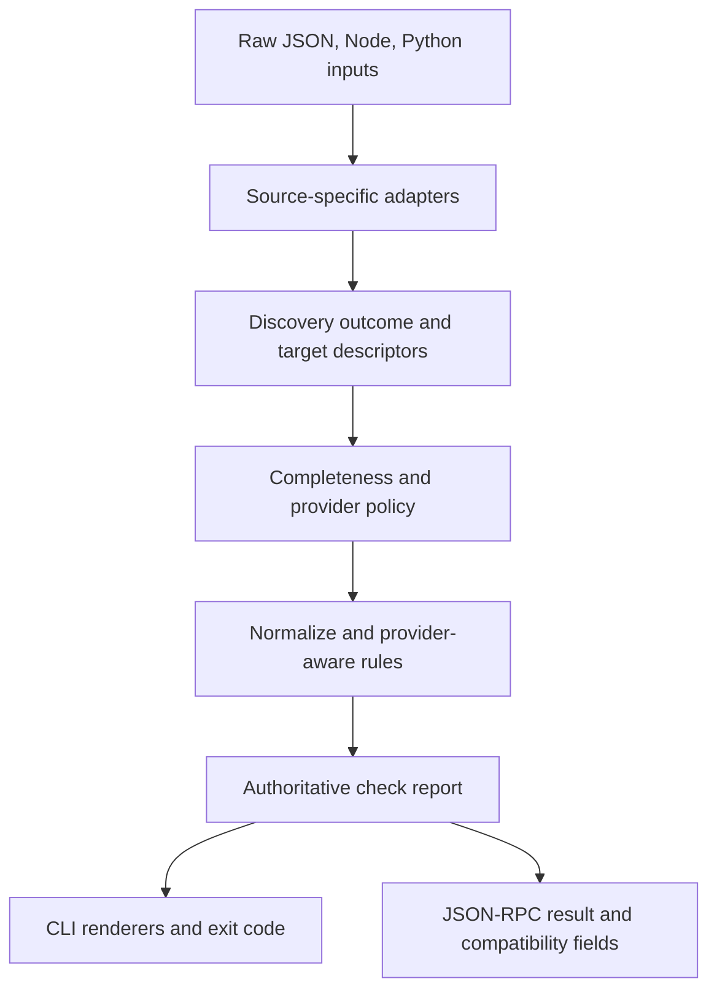
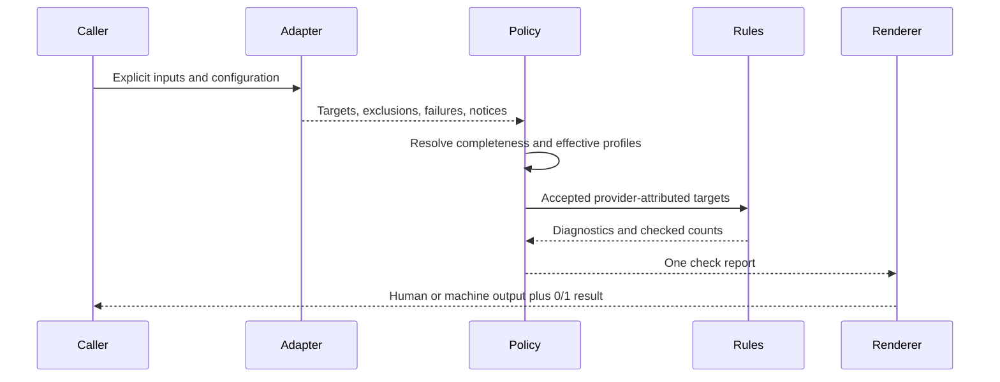
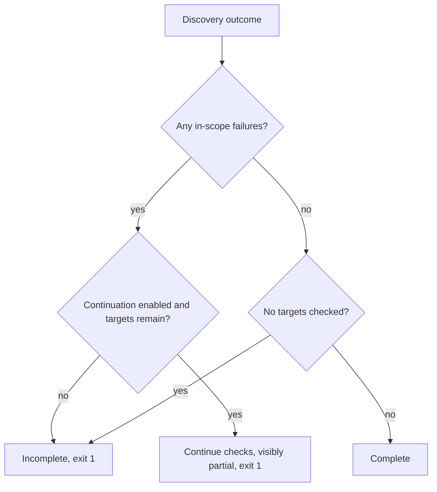
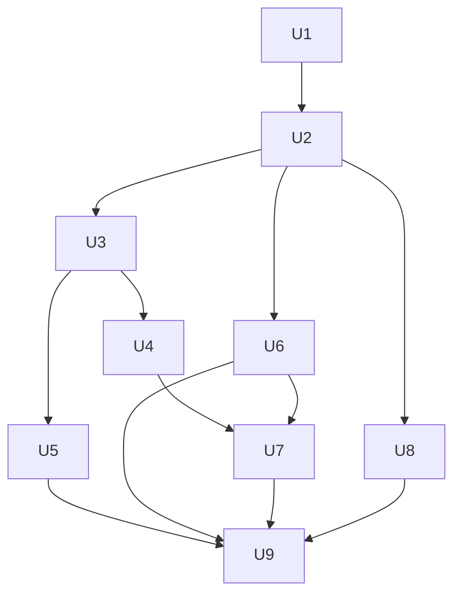

# Structured Output Reliability Remediation - Plan

## Goal Capsule

- **Objective:** Make exit 0 and JSON-RPC success prove that every in-scope schema was discovered, evaluated, attributed to the intended provider, and checked against current provider rules.
- **Authority:** `AGENTS.md` and the Product Contract govern scope; Key Technical Decisions govern implementation choices; current official provider and SDK documentation governs external behavior.
- **Execution profile:** Deep, contract-first remediation with characterization coverage before behavior changes and packed-artifact smoke verification before release changes.
- **Stop conditions:** Pause if a change alters provider profile IDs, diagnostic codes, the 0/1 exit-code contract, or regression-corpus expectations without explicit review; pause if live provider evidence contradicts a planned rule.
- **Tail ownership:** U9 owns the final repository-wide verification, documentation, and release-readiness gate after U1-U8 are complete.

---

## Product Contract

### Summary

This plan closes the full validated reliability review, with false-green discovery, provider attribution, runtime compatibility, and broken public packages treated as release blockers. Supported paths must complete visibly, remain visibly degraded only while explicit continuation controls gather partial results, or fail loudly; degraded coverage never reports success.

### Problem Frame

The Rust normalization and rule engine is credible, but the ingestion and distribution boundaries can omit targets and still report success. Node and Python sidecars represent failures as warnings or drop them, provider detection is process-global, current SDK surfaces are missed, and published artifacts do not match their documentation.

The same missing boundary contract caused CLI/server drift, unvalidated provider envelopes, incomplete conformance, and tests that prove source-tree behavior rather than installed behavior. One-off matcher fixes would leave the product unable to prove what it checked.

### Requirements

**Completeness and automation contract**

- R1. Every explicit path, glob, package, or source request reports attempted, excluded, discovered, checked, and failed counts from one derived run outcome.
- R2. Empty or partial in-scope discovery always exits 1 and returns JSON-RPC failure; explicit continuation controls may gather and emit partial results but never accept degraded coverage as success.
- R3. Raw JSON, Node, Python, CLI JSON, human output, and JSON-RPC derive status, counts, failures, warnings, diagnostics, and exit behavior from one report.
- R4. Each usage target retains separate schema identity, usage-site identity, provider resolution, effective profiles, envelope metadata, and source spans; ambiguous automatic provider selection fails rather than guesses.

**SDK and runtime compatibility**

- R5. Canonical adapters discover documented OpenAI, Anthropic, AI SDK 6, and retained legacy AI SDK surfaces through canonical, aliased, and namespace imports; docs and fixtures declare exact minimum/current versions and a 2.0 removal boundary for deprecated surfaces.
- R6. The packed npm package loads TypeScript on Node 18, 20, and 22 and converts Zod v3, earliest-supported v4, current v4, and `zod/mini` without repository dev dependencies.
- R7. Statically resolvable response-format, schema, and tool envelope values are validated at their usage site; unresolved required metadata is a typed completeness failure.

**Provider fidelity and profiles**

- R8. OpenAI string budgets count property names, definition names, enum strings, and const strings by characters and enforce the conditional per-enum limit at exact boundaries.
- R9. Local-reference depth behavior is decided by a recorded opt-in live provider probe; any resulting rule is semantic, cycle-safe, and covered at the 10/11-level boundary.
- R10. Invalid restriction shapes and unknown profile keywords fail during loading with structured errors; valid profile syntax preserves stable IDs, aliases, codes, and provider-agnostic rule activation.
- R11. Offline conformance runs keyword and structural truth through the production normalizer and `RuleSet`; live refreshes distinguish provider rejection from transport/auth failure and incomplete lint evaluation.

**Distribution, release, and maintainability**

- R12. A clean Python 3.9+ environment can install the wheel, invoke `schemalint`, and run Pydantic discovery without installing a second SchemaLint package; supported Pydantic v1/v2 behavior remains explicit and tested.
- R13. npm verifies release archives against an immutable digest shipped in the npm artifact, and release tooling is pinned or digest-verified before execution.
- R14. PR CI builds and tests Rust, TypeScript source and generated output, Python source, executable conformance, documentation, and clean npm/PyPI artifacts using documented commands.
- R15. One shared orchestration path replaces CLI/server and Node/Python policy duplication, no production source file exceeds 400 lines, and the non-reusable disk cache is removed without an unmeasured replacement.

### Key Flows

- F1. **Direct schema check:** Resolve explicit files and profiles, count inputs, normalize and check every matched schema, then render one complete report.
- F2. **Dynamic source check:** Discover targets through a language sidecar, classify exclusions/notices/failures, resolve providers and profiles per usage, check accepted targets, then evaluate strictness policy.
- F3. **Mixed-provider check:** Preserve provider ownership per usage; explicit profile lists continue to check every target against every selected profile.
- F4. **Installed-package check:** Install the built tarball or wheel into an isolated project, use only packaged runtime contents, and execute the documented source-discovery flow.
- F5. **Provider refresh:** Run deterministic offline truth on every PR; run credentialed live probes separately and promote reproducible provider behavior only after human classification.

### Acceptance Examples

- AE1. Given an explicit JSON glob matching no files, when no empty-run opt-in is set, then the run exits 1 and reports `empty` coverage rather than a clean zero-schema result.
- AE2. Given two located Node targets where one evaluation fails, when partial runs are not allowed, then the valid target may be diagnosed but the overall run is incomplete and exits 1.
- AE3. Given the same partial run with an explicit continuation control, then remaining targets are checked and output includes the failure, remains marked partial, exits 1, and returns JSON-RPC failure.
- AE4. Given OpenAI and Anthropic usages in either source order, when profiles are automatic, then each target receives its provider profile; an ambiguous generic target requires explicit configuration.
- AE5. Given aliased helpers, Anthropic `zodOutputFormat`, AI SDK `Output.array`, and `dynamicTool`, then each usage is discovered with canonical kind/provider/envelope data and an intentionally invalid schema produces a diagnostic.
- AE6. Given an isolated packed npm install on Node 18, 20, or 22, then a TypeScript fixture with a tsconfig alias is discovered without global `tsx` or repository dev dependencies.
- AE7. Given a clean Python environment containing only the built wheel and supported Pydantic, then `schemalint --version`, raw checking, and `check-python` all use the documented command and bundled sidecar.
- AE8. Given an unknown restriction keyword or non-array restrictions value, then profile loading returns a structured configuration error and never panics or silently ignores it.
- AE9. Given OpenAI budget boundary schemas and the recorded depth case, then offline rules match the classified provider truth at the exact accepted/rejected boundary.
- AE10. Given live conformance transport failure, then the refresh is an infrastructure failure and cannot be recorded as provider acceptance or rejection.
- AE11. Given a replaced archive paired with a replaced remote checksum, then npm rejects it because the packaged immutable manifest does not match.
- AE12. Given equivalent CLI and JSON-RPC requests, then their normalized reports match after excluding transport-only metadata such as duration.

### Scope Boundaries

In scope are all validated correctness, compatibility, packaging, conformance, CI, maintainability, and release-integrity findings, plus raw-JSON/exclusion behavior required to make the shared completeness contract coherent.

#### Deferred to Follow-Up Work

- Removing deprecated JSON-RPC flat fields or changing method/error semantics is deferred to a major output-schema release.
- JSON-RPC profile listing, LSP, watch mode, network transport, generic plugin architecture, and automatic schema rewriting remain separate work.
- Platform-native npm packages may replace runtime downloading later; this plan keeps the current launcher and makes its trust chain independent.

---

## Planning Contract

### Key Technical Decisions

- KTD1. **One typed report is authoritative.** A counted outcome derives completeness and status; CLI renderers and JSON-RPC compatibility fields consume it and cannot recompute policy independently.
- KTD2. **The 1.x migration is additive.** CLI JSON 1.1 preserves every 1.0 top-level field's name, type, and meaning while adding typed coverage/targets/report data. JSON-RPC methods, requests, errors, and derived flat response fields remain compatible through 1.x and are removable only in 2.0; the lockstep Rust/sidecar protocol has no mixed-version support. Strict completeness may intentionally change success and exit results without becoming a wire-format break.
- KTD3. **Warnings and failures are distinct.** Source-adapter notices, including successful Pydantic-v1 extraction notices, normalize into authoritative report warnings; located-target import, evaluation, conversion, normalization, profile, or envelope failure affects completeness.
- KTD4. **Provider ownership is per usage.** Direct provider helpers resolve definitively; generic targets inherit only one unambiguous provider, otherwise require explicit profiles; explicit multi-profile behavior is unchanged.
- KTD5. **Adapters dispatch on canonical target kind.** Local spelling and namespace aliases map to descriptors that define schema arguments, provider certainty, and envelope fields.
- KTD6. **Preserve Node 18+.** Ship a package-local TypeScript loader and positively select Zod v3 versus native v4/mini conversion instead of relying on Node 22 behavior or floating feature detection.
- KTD7. **Profiles use a typed keyword domain.** Parsing rejects unknown values, rule construction is fallible, and diagnostic prefixes continue to derive from profile data.
- KTD8. **Provider truth is deterministic by default.** Offline truth/profile parity runs on every PR; credentialed probes are opt-in artifacts, and semantic `$ref` depth is implemented only if the recorded provider result requires it.
- KTD9. **The PyPI wheel owns its public command and sidecar.** Exclude its wrapper crate from cargo-dist collision paths, install the binary as `schemalint`, and package one canonical Python sidecar source tree.
- KTD10. **Release integrity is anchored in immutable artifacts.** Build final archives and wheels, generate the target-to-digest manifest, pack npm once, and test those exact bytes before any public publish. After publication, never rebuild under the same version; verify existing artifacts by digest and fix partial releases forward with a new patch.
- KTD11. **Simplify only after semantics are characterized.** Preserve the bounded in-memory cache, delete disk persistence, and split orchestration/launcher files under tests after the final contract is fixed.

### High-Level Technical Design

### Sequencing

U1-U6 form the release-blocking graph, including the evidence-gated U5 decision and installed-wheel U6 proof. U7 and U8 proceed only on their declared contracts; U9 is the sole tail after every artifact and file layout reaches final shape.

### Implementation Constraints

- Preserve MSRV 1.80, profile IDs/aliases, diagnostic-code prefixes, source-span behavior, and the 0/1 exit-code contract.
- Preserve newline-delimited JSON-RPC over stdin/stdout and one sequential sidecar process per batch; do not introduce a plugin framework or network service.
- Resolve exclusions before import/evaluation and before completeness counts; malformed exclusions are configuration failures.
- Do not silently update regression-corpus `.expected` files or snapshots; review every intentional change.
- Keep normal CI offline and deterministic; live-provider credentials appear only in manual or protected workflows.

---

## Implementation Units

### U1. Type profile keywords and make rule construction fallible

- **Goal:** Eliminate silent profile misconfiguration, leaked strings, and rule-construction panics before the shared report begins carrying profile failures.
- **Requirements:** R10, R15; AE8.
- **Dependencies:** None.
- **Files:** Create `crates/schemalint/src/profile/keyword.rs`; modify `crates/schemalint/src/profile/{mod.rs,parser.rs}`, `crates/schemalint/src/rules/registry.rs`, `crates/schemalint/tests/profile_tests/*`, and `crates/schemalint/tests/rules_tests/*`.
- **Approach:** Replace raw keyword keys and duplicated lookup tables with one exhaustive keyword type and conversion boundary; parse supported restriction forms into typed data and return errors before building a `RuleSet`.
- **Patterns to follow:** Preserve `IndexMap` ordering, `profile.code_prefix`, and the existing static/profile-generated/profile-gated registration model.
- **Test scenarios:** Valid built-ins preserve rule codes and ordering; unknown keywords fail; malformed restriction containers fail; valid restrictions remain accepted; CLI/server profile errors return exit/result failure without panic.
- **Verification:** All built-in profiles construct through the fallible path and no `Box::leak`, unknown-keyword panic, or silent restriction skip remains.

### U2. Establish the counted report and shared completeness policy

- **Goal:** Make one report and policy govern direct, Node, Python, CLI, and server outcomes.
- **Requirements:** R1-R3, R15; AE1-AE3, AE12.
- **Dependencies:** U1.
- **Files:** Modify `crates/schemalint/src/{ingest.rs,subprocess.rs}`, `crates/schemalint/src/cli/{args.rs,discover.rs,check.rs,check_node.rs,check_python.rs,pipeline.rs,emit_json.rs,server.rs}`, Node/Python discovery protocol sources, and cross-language tests; create `crates/schemalint/src/cli/{report.rs,discovery_policy.rs}` and focused `crates/schemalint/src/cli/server/*` modules.
- **Approach:** Own the lockstep discovery protocol here: return typed raw-input outcomes; introduce targets, failures, adapter notices normalized to report warnings, counts, continuation policy, and additive compatibility serialization; calculate status and exit behavior once, apply exclusions before attempts, and derive legacy JSON-RPC fields from the report. U3 enriches Node targets; U6 packages the stabilized Python sidecar.
- **Execution note:** Start with characterization tests for today's empty/partial paths, then invert them under the strict policy while preserving explicit compatibility cases.
- **Test scenarios:** Raw no-match, Node/Python zero-target, one-of-many and all-target failures, excluded failures, Pydantic-v1 notice, all policy combinations, renderer parity, server survival after an incomplete request, and real checked-schema counts for clean inputs.
- **Verification:** No check path can emit exit 0 or `success: true` for disallowed incomplete coverage, and no completeness fact exists only on stderr.

### U3. Canonicalize SDK targets, provider ownership, and envelopes

- **Goal:** Discover current SDK usages independent of local spelling and preserve provider/envelope identity per usage site.
- **Requirements:** R4, R5, R7; AE4, AE5.
- **Dependencies:** U2.
- **Files:** Create `npm/schemalint/src/sdk_adapters.ts`; modify `npm/schemalint/src/{target_imports.ts,targets.ts,target_resolution.ts,target_emit.ts,discover_ast.ts,discover.ts,types.d.ts}`, `npm/schemalint/src/__tests__/{test_discover.ts,fixtures/*}`, `crates/schemalint/src/ingest.rs`, and `crates/schemalint/tests/node_tests/e2e.rs`.
- **Approach:** Map imports and namespace members to canonical adapter descriptors, emit one target per usage site, attach provider resolution and spanned envelope fields, and remove first-match provider hints. Explicit profiles still apply to every target; ambiguous automatic targets fail.
- **Test scenarios:** Canonical/aliased/namespace forms across the declared minimum/current SDK matrix, AI SDK object/array/tools plus retained legacy calls, two providers in both source orders, one schema reused by two providers/names, dynamic unresolved envelope values, and explicit multi-profile checks.
- **Verification:** Every supported fixture produces the expected canonical target and provider-tagged diagnostic; source order cannot change effective profiles.

### U4. Make the packed Node runtime and Zod conversion self-contained

- **Goal:** Preserve Node 18+ TypeScript ingestion and support the declared Zod range from the installed npm artifact.
- **Requirements:** R6; AE6.
- **Dependencies:** U3.
- **Files:** Modify `npm/schemalint/{package.json,package-lock.json,bin/schemalint-zod.js}`, `npm/schemalint/src/evaluate.ts`, `crates/schemalint/src/node/{mod.rs,resolve.rs}`, npm fixture projects/tests, and Node integration tests.
- **Approach:** Ship and invoke a package-local TypeScript loader on the compiled-helper path; resolve the user's Zod generation positively and use native package conversion for v4/mini while retaining `zod-to-json-schema` only for v3.
- **Execution note:** Prove behavior from packed tarballs and version-pinned fixtures before changing the advertised support matrix.
- **Test scenarios:** Node 18/20/22 with `.ts`, `.js`, tsconfig aliases, missing loader, Zod v3, earliest/current v4, mini, unknown/non-Zod values, and conversion failures that remain typed discovery failures.
- **Verification:** Packed installs discover and lint a real invalid TypeScript schema on every supported runtime without global tools.

### U5. Complete provider-envelope, budget, depth, and conformance truth

- **Goal:** Make provider-specific failures executable through production rules and reproducible truth artifacts.
- **Requirements:** R7-R11; AE9, AE10.
- **Dependencies:** U1, U3.
- **Files:** Create `crates/schemalint/src/rules/envelope.rs`; modify `crates/schemalint/src/rules/{mod.rs,class_b/budget.rs}`, relevant IR/normalizer traversal, built-in profiles, `crates/schemalint/tests/{provider_limits_tests.rs,structural_tests.rs,rules_tests/*}`, `crates/schemalint-conformance/{Cargo.toml,src/lib.rs,src/truth.rs,tests/truth_integration_tests.rs}`, and `scripts/validation/{probe_limits.py,compare_with_openai.py,README.md}`.
- **Approach:** Validate spanned envelope metadata outside JSON Schema keyword maps; count documented OpenAI characters and conditional enum budgets exactly; run structural truth through the real normalizer/rules; record four live-refresh states. Probe `$ref` depth first and implement semantic cycle-safe traversal only if provider behavior confirms it.
- **Test scenarios:** Invalid/valid format and tool names, definition/const/enum Unicode counts, 250/251 and 15,000/15,001 boundaries, 10/11-hop and cyclic refs, every structural truth case, transport/auth failure, and incomplete linter evaluation.
- **Verification:** Offline truth/profile parity is deterministic, the validation README works from a clean checkout, and the depth decision cites a recorded provider artifact.

### U6. Repair the PyPI command and bundled Pydantic sidecar

- **Goal:** Make the wheel satisfy the documented one-install Python workflow.
- **Requirements:** R12; AE7.
- **Dependencies:** U2.
- **Files:** Modify `crates/schemalint-python/{Cargo.toml,pyproject.toml,README.md,src/main.rs,python/*}`, relocate and delete `python/schemalint-pydantic/*`, update workspace/PyPI packaging configuration, and modify Python integration tests.
- **Approach:** Install the wheel binary as `schemalint`; exclude the wrapper from cargo-dist and concurrent workspace gates, verify it separately, and make `crates/schemalint-python/python/` the single canonical sidecar/test tree. Align Python at 3.9+ and test Pydantic v1/v2 without runtime installation.
- **Execution note:** Prefer clean-wheel runtime smokes over unit-only proof; do not duplicate the sidecar source during packaging.
- **Test scenarios:** Wheel contents and command inventory, clean installs across supported Python/Pydantic versions, raw check, diagnostic-producing `check-python`, missing Pydantic, missing target package, and sidecar module resolution from the installed environment.
- **Verification:** The exact README workflow succeeds in a fresh environment and the undocumented `schemalint-python-bin` name is absent from public instructions and release smoke tests.

### U7. Anchor npm and release tooling integrity

- **Goal:** Make the existing runtime downloader verify immutable npm-shipped digests and stop executing unverified release tools.
- **Requirements:** R13, R15; AE11.
- **Dependencies:** U4, U6.
- **Files:** Split and modify `npm/schemalint/index.cjs` into focused CommonJS launcher/download/integrity modules; add a packaged versioned digest manifest; modify `npm/schemalint/package.json`, npm launcher tests, `dist-workspace.toml`, and `.github/workflows/release.yml`.
- **Approach:** Own the release transaction: validate version parity; build final archives/wheels; generate and validate their manifest; pack npm once; run every pre-publish smoke; upload GitHub assets; smoke that same tarball against them; publish the already-tested channel artifacts; then run registry read-back. Verify only the packaged manifest, and pin actions/tools immutably.
- **Test scenarios:** Valid archive, archive tamper, replaced remote checksum, missing/wrong target digest, manifest/package version mismatch, redirects, extraction guards, and packed-tarball smoke before publish.
- **Verification:** No registry publish starts before pre-publish gates pass; tested and published bytes match; existing artifacts count as success only after digest read-back. A channel failure retains a classified partial-release report and is yanked/deprecated where supported, never rebuilt at the same version.

### U8. Remove net-negative persistence and finish file-boundary simplification

- **Goal:** Delete unused complexity and leave every production source file within the repository's size and responsibility limits.
- **Requirements:** R15.
- **Dependencies:** U2.
- **Files:** Modify `crates/schemalint/src/{cache.rs,subprocess.rs}`, `crates/schemalint/src/cli/{pipeline.rs,server.rs,server/*}`, `crates/schemalint/tests/cache_tests.rs`, related integration-test modules, and `Cargo.toml`.
- **Approach:** Remove `DiskCache`, disk serialization/eviction/temp cleanup, and the `dirs` dependency while retaining bounded in-memory collision-safe reuse; move large in-module tests to test modules and keep protocol, handlers, policy, and launcher concerns separate.
- **Test scenarios:** In-memory hit/miss/collision/eviction, repeated server checks, narrow cache-lock scope, no cache-directory creation, unchanged diagnostics across refactor, and source-size guard coverage.
- **Verification:** No U8-owned production source exceeds 400 lines, no dead disk-cache code or directories remain, and behavior remains characterized by U2 tests; U9 owns the repository-wide size gate after U7.

### U9. Ratchet CI, documentation, and release-ready verification

- **Goal:** Make the final source and artifact contracts mandatory before merge or publish.
- **Requirements:** R14, R15; AE1-AE12.
- **Dependencies:** U5, U6, U7, U8.
- **Files:** Modify `.github/workflows/{ci.yml,release.yml,docs.yml}`, add a source-size/generated-artifact gate under `scripts/`, update `README.md`, `CHANGELOG.md`, `docs/docs/guide/{installation.md,ci-integration.md}`, provider/rule docs, and relevant package scripts.
- **Approach:** Ratchet unit-local gates in CI: rebuild and diff generated output, test executable truth, install exact release-candidate artifacts in declared runtime/platform matrices, enforce the 400-line ceiling, document strict discovery migration/JSON-RPC 1.1 controls, and keep live probes manual/protected.
- **Test scenarios:** CI detects stale `dist`, missing wheel sidecar, wrong command name, unsupported Node/Python matrix member, source-size regression, stale generated rule docs, docs transport mismatch, and live-probe infrastructure failure without misclassifying provider truth.
- **Verification:** Every documented install/check flow is exercised from built artifacts and all deterministic gates pass without provider credentials.

---

## System-Wide Impact

- **Users and CI:** Strict discovery intentionally turns previous false-green empty/partial runs into failures; compatibility controls and migration notes must ship with the behavior change.
- **Automation:** CLI JSON and JSON-RPC gain additive typed report data; old fields remain derived and deprecated for one 1.x window.
- **Contributors:** SDK support becomes an adapter-and-matrix change rather than a string-condition patch; profile keywords and provider truth become exhaustive typed domains.
- **Release engineering:** One staged transaction produces final archives, wheels, and one npm tarball; pre-publish and registry read-back jobs consume those immutable bytes rather than source checkouts or repacks.
- **Performance:** Disk persistence is removed; bounded in-memory reuse remains. Any future persistent cache requires a benchmark proving cross-run value.

---

## Risks and Dependencies

- **Behavior-breaking strictness:** Optional generators may start failing. Provide named empty/partial CLI and JSON-RPC continuation controls that preserve `empty`/`partial` status and failure; never convert incomplete coverage to success.
- **Wire migration:** Rust and both sidecars must change atomically. Mitigate with cross-language golden fixtures and one authoritative serializer.
- **Provider ambiguity:** Generic AI SDK targets may not reveal a provider. Require explicit profiles rather than guessing or silently checking the wrong provider.
- **Provider drift:** Rules and SDK surfaces change independently. Pin compatibility fixtures and keep dated offline truth plus protected live refreshes.
- **Depth uncertainty:** The `$ref` finding remains evidence-gated. The implementation unit closes it either with a confirmed semantic rule or a recorded provider-acceptance result and corrected rule documentation.
- **Packaging layout:** Maturin/cargo-dist constraints may force source relocation. Preserve one canonical sidecar source tree and reject copy-at-release designs.
- **Release ordering:** Validate versions, build/stage all artifacts, generate the manifest, pack npm once, and pass all local smokes before publication. GitHub assets precede the npm runtime smoke/publish; post-publish registry read-back closes each channel. Partial releases are reported and fixed forward, never replaced in place.

---

## Verification Contract

| Gate | Applies to | Required proof |
|---|---|---|
| `cargo test --workspace --exclude schemalint-python` | U1-U9 | Core Rust, server, sidecar integration, conformance, and regression tests pass without binary-output collision |
| `cargo clippy --workspace --exclude schemalint-python -- -D warnings` | U1-U9 | No warnings across concurrently built workspace packages |
| Separate `schemalint-python` build and Clippy | U6, U9 | The public-command wrapper compiles cleanly in an isolated package gate before the wheel matrix |
| `cargo fmt --all -- --check` | U1-U9 | Rust formatting is clean |
| `cargo bench --no-run --workspace --exclude schemalint-python` | U5, U8, U9 | Benchmark targets compile after traversal/cache changes without binary-output collision |
| `npm run build && npm test` in `npm/schemalint` | U3, U4, U7, U9 | TypeScript builds, adapter/runtime/launcher tests pass, and tracked `dist` is fresh |
| Python pytest suite | U2, U6, U9 | Discovery, protocol, Pydantic-version, and package behavior pass |
| Packed npm runtime matrix | U4, U7, U9 | Node 18/20/22 install the tarball and lint real TypeScript without repository dependencies |
| Clean wheel matrix | U6, U9 | Supported Python/Pydantic environments execute the exact documented command and `check-python` flow |
| Offline conformance parity | U5, U9 | Every keyword and structural truth case runs through production rules with classified outcomes |
| Documentation and generated-artifact diff | U5, U9 | Rule docs, TypeScript `dist`, and Docusaurus build are reproducible with no unexplained diff |
| Source-size gate | U8, U9 | Every production source file is at most 400 lines |
| Release manifest and inventory | U7, U9 | Tag/package/lockfile/CLI/schema versions agree; every final archive is covered exactly once; npm and wheel contain all advertised runtime assets |
| Immutable release/read-back | U7, U9 | The single tested npm tarball and staged crate/wheels are published unchanged, then installed from each enabled registry and exercised end to end |
| Protected live provider probe | U5 | Versioned evidence resolves `$ref` depth and any later disputed provider boundary; not required for ordinary PR CI |

---

## Definition of Done

### Global Completion

- Exit 0 or JSON-RPC accepted success means the run satisfied explicit completeness policy and contains no error diagnostics.
- All supported adapters, runtime versions, provider rules, and packaged workflows meet their Acceptance Examples.
- Profile IDs, aliases, diagnostic codes, exit codes, and intentionally reviewed corpus expectations remain stable.
- Public documentation describes actual stdin/stdout transport, strict discovery migration, installed commands, supported runtimes, and provider-refresh workflow.
- No production source file exceeds 400 lines; disk-cache persistence and abandoned experimental code are removed.
- All deterministic Verification Contract gates pass on a clean checkout, and release-only/live gates produce retained artifacts with classified outcomes.
- Release completion requires retained per-channel read-back success; disabled channels are explicit, and any public partial release is yanked/deprecated where possible and fixed forward under a new version.

### Unit Completion

| Unit | Done signal |
|---|---|
| U1 | Invalid profiles fail before rule execution and all built-ins retain stable behavior |
| U2 | One report controls every completeness, rendering, server, and exit decision |
| U3 | Current/aliased SDK usages carry correct per-usage provider and envelope metadata |
| U4 | Packed npm succeeds across Node/Zod matrix without global tooling |
| U5 | Envelope/budget/conformance truth is executable and depth is evidence-resolved |
| U6 | Clean wheel exposes `schemalint` and bundled Pydantic discovery |
| U7 | npm archive verification and release tools use independent immutable trust |
| U8 | Disk persistence is gone and all production files satisfy the 400-line rule |
| U9 | CI and docs exercise the final source and artifact contracts end to end |

---

## Sources and Research

- `docs/plans/2026-05-01-001-feat-phase-3-pydantic-ingestion-plan.md` and `docs/plans/2026-05-01-002-feat-phase-4-zod-ingestion-plan.md` establish the shared sidecar, JSON-RPC, source-span, and TypeScript-loader architecture retained here.
- `docs/plans/2026-05-01-003-feat-phase-5-distribution-conformance-plan.md` establishes offline/expensive conformance tiers and release-channel architecture; this plan makes truth executable and artifact checks authoritative.
- `docs/plans/2026-05-02-005-feat-phase-6-release-plan.md` establishes release ordering but contains superseded assumptions about the PyPI binary name and source-only coverage.
- `docs/solutions/best-practices/schemalint-phase2-learnings.md` requires emitted-contract assertions, visible I/O failures, provider-agnostic registry activation, narrow cache locks, and orchestration consolidation.
- [OpenAI structured outputs](https://developers.openai.com/api/docs/guides/structured-outputs) defines current schema budgets and supported subset.
- [Anthropic structured outputs](https://platform.claude.com/docs/en/build-with-claude/structured-outputs) defines current output/tool surfaces and complexity behavior.
- [AI SDK 6 Output reference](https://github.com/vercel/ai/blob/ai%406.0.0/content/docs/07-reference/01-ai-sdk-core/28-output.mdx) defines current output helpers.
- [Zod v4 JSON Schema reference](https://github.com/colinhacks/zod/blob/v4.0.1/packages/docs/content/json-schema.mdx) defines package-level native conversion for the earliest supported v4 line.

---

## Appendix

### Validated Finding Trace

| Finding | Severity | Primary seam | Requirement | Unit |
|---|---|---|---|---|
| False-green discovery | P1 | `npm/schemalint/src/discover.ts` | R1-R3 | U2 |
| Missed current/aliased SDK targets | P1 | `npm/schemalint/src/target_imports.ts` | R5 | U3 |
| First-import mixed-provider selection | P1 | `npm/schemalint/src/discover.ts` | R4 | U3 |
| Broken PyPI command/sidecar contract | P1 | `crates/schemalint-python/Cargo.toml` | R12 | U6 |
| `$ref` depth bypass | P1, evidence-gated | `crates/schemalint/src/rules/class_b/budget.rs` | R9 | U5 |
| Node 18/20 TypeScript failure | P1 | `crates/schemalint/src/node/mod.rs` | R6 | U4 |
| Partial Zod v4/mini conversion | P2 | `npm/schemalint/src/evaluate.ts` | R6 | U4 |
| Incomplete OpenAI string budgets | P2 | `crates/schemalint/src/rules/class_b/budget.rs` | R8 | U5 |
| Unvalidated provider envelopes | P2 | `npm/schemalint/src/targets.ts` | R7 | U3, U5 |
| Profile typo ignore/panic | P2 | `crates/schemalint/src/profile/parser.rs` | R10 | U1 |
| Missing npm/Python source CI | P2 | `.github/workflows/ci.yml` | R14 | U9 |
| Orchestration and file-size drift | P2 | `crates/schemalint/src/cli/server.rs` | R3, R15 | U2, U8 |
| Non-reusable disk cache | P2 | `crates/schemalint/src/cache.rs` | R15 | U8 |
| Circular runtime checksum trust | P2 | `npm/schemalint/index.cjs` | R13 | U7 |
| Non-executable structural truth | P2 | `crates/schemalint-conformance/src/lib.rs` | R11 | U5 |
