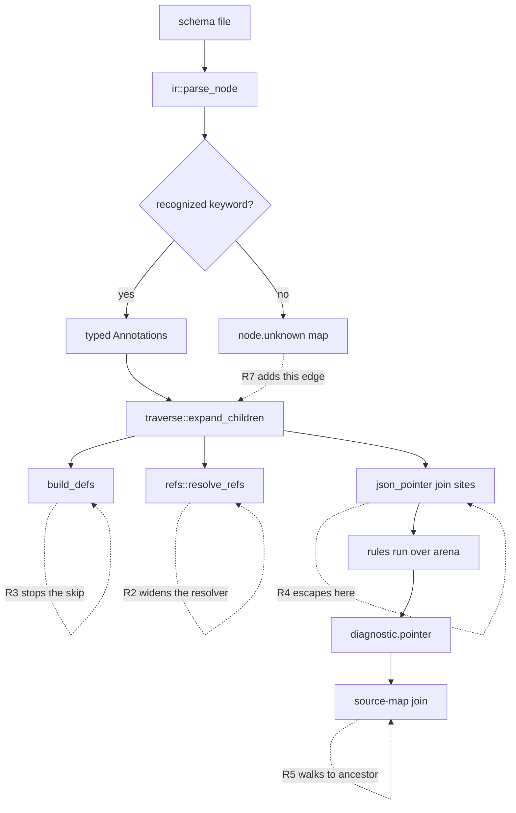

# Lint Correctness and Provider Profile Fidelity - Plan

## Goal Capsule

**Objective.** Correct what the linter reports. Eleven defects are verified against the built binary. Two provider profiles disagree with the published provider documentation. Fix both classes.

**Authority.** The Product Contract requirements win on behavior. A Key Technical Decision wins on mechanism inside its cited requirements. A unit overrides neither.

**Execution profile.** Each unit is one atomic commit. Units are ordered by dependency, not by defect number.

**Stop conditions.** Stop and ask if a fix makes an existing corpus schema fail in a way this plan does not predict. Stop if a provider claim in this plan cannot be traced to the cited documentation.

**Tail ownership.** The implementer runs every gate in the Verification Contract before the last commit.

---

## Product Contract

### Summary

This plan corrects the linter's own accuracy. It repairs four normalization defects that make legal schemas unlintable or invisible, two diagnostic-quality defects, two coverage gaps around unrecognized keywords, and the provider profiles for OpenAI and Anthropic. `--fix` is a separate plan and this one leaves the pointer contract in the state that plan needs.

### Problem Frame

The tool's value is fidelity to what a provider accepts. A research pass measured that fidelity and found it broken in three directions.

Legal schemas cannot be linted at all. A Zod 3 user who defines a sub-schema once and uses it twice gets `unresolved internal $ref: #/properties/a` and no lint. A Zod 3 user who writes `z.tuple()` gets `invalid JSON Schema root: expected object or boolean, got array`. Both fail closed with exit 1, so neither is a false green, but the schema is never checked. Zod 3 is the version most projects still run.

Some schemas are silently under-checked. A `definitions/D` entry shadowed by a same-named `$defs/D` is never allocated as a node, so no rule ever visits it. Any keyword outside the 42 the engine knows passes without comment, and any subschema nested inside such a keyword is invisible to every rule. A schema can hide a forbidden keyword under `additionalItems` and score zero issues.

The profiles carry numbers and statuses that the providers do not publish. Anthropic's `max_optional_properties = 24` and `max_union_properties = 16` appear in no Anthropic document, so they reject schemas the API accepts. Anthropic documents recursive schemas and a non-object root as unsupported, and the profile has no rule for either. OpenAI lists only `pattern` and `format` as supported string properties, and the profile marks `minLength`, `maxLength`, `patternProperties`, and `discriminator` as `allow`.

### Requirements

**Normalization correctness**

- R1. A schema with the draft-07 tuple form `items: [A, B]` normalizes and lints. Each tuple member is its own node.
- R2. An internal `$ref` that points anywhere inside the document resolves. Only a fragment that names no existing node is an error.
- R3. A `definitions` entry shadowed by a same-named `$defs` entry is allocated as a node and linted.
- R4. Every JSON pointer the tool emits is a valid RFC 6901 pointer. A property, pattern, or definition name containing `/` or `~` is escaped.

**Diagnostic quality**

- R5. A diagnostic whose pointer has no exact source-map entry carries the location of its nearest mapped ancestor.
- R6. An empty Zod discovery result names its cause. The three causes are: the glob matched no file on disk, files matched on disk but are outside the TypeScript program, and files were checked and hold no schema.

**Coverage of unrecognized keywords**

- R7. A subschema nested inside a keyword the engine does not recognize is walked into the arena and linted.
- R8. A keyword outside the recognized set is reported under a profile-level policy. The policy accepts allow, warn, and forbid, and defaults to warn.

**Provider fidelity**

- R9. The Anthropic profile carries no limit that Anthropic does not publish. `max_optional_properties` and `max_union_properties` are removed together with their rules and truth cases.
- R10. The Anthropic profile rejects a recursive schema and a non-object root. Both are documented as unsupported.
- R11. The OpenAI profile marks `minLength`, `maxLength`, `patternProperties`, and `discriminator` as `warn`. None is in OpenAI's published supported list, and none is documented as rejected.
- R12. Each profile entry whose status is an inference rather than a documented provider statement carries a comment saying so, in the profile TOML. This covers the seven Anthropic keywords forbidden on no documented basis and the six left `unknown`, and the four OpenAI keywords moved to `warn`.

### Scope Boundaries

- The tool does not rewrite Zod or Pydantic source. The source-location data cannot support it.
- The tool does not fetch a remote `$ref`.
- Budget violations keep no repair. They need user data removed.

#### Deferred to Follow-Up Work

- `--fix` in every form: the CLI flag, the JSON-RPC method, the runtime repair call for the npm and Python packages, and the structured fix payload on the diagnostic.
- `preserve_order` for `serde_json`. It changes nothing a user sees until something rewrites a file, so it belongs with `--fix`.
- Exact source spans for Zod and Pydantic, which would need a column and an expression span from both sidecars.
- The stashed `max_enum_items` work. It stays in `stash@{0}`.

#### Outside this product's identity

- Validating a schema against JSON Schema itself. The tool checks provider compatibility, not schema validity.

### Sources

- Scope study with every reproduction: https://www.proofeditor.ai/d/i71awbpr
- OpenAI Structured Outputs guide: https://developers.openai.com/api/docs/guides/structured-outputs
- Anthropic structured outputs and strict tool use: https://platform.claude.com/docs/en/build-with-claude/structured-outputs and https://platform.claude.com/docs/en/agents-and-tools/tool-use/strict-tool-use
- Prior learnings: `docs/solutions/best-practices/schemalint-phase2-learnings.md`. Learning 2 is the same defect class as R4, one layer out — an unescaped value in a delimiter-based format.

---

## Planning Contract

### Key Technical Decisions

- KTD1. Escaping is a four-sided change, landed together. Three sides build pointers — the Rust normalizer, the Node source-map builder, and the Python source-map builder — and a fourth consumes them by splitting: `keyword_schema_pointer` in `crates/schemalint-conformance/src/production.rs`. A fifth builder exists in `crates/schemalint-conformance/src/lib.rs` and stays unescaped on purpose: it belongs to the declaration-only truth engine and its pointers are never joined against arena output. State that so a later reader does not treat it as a missed side. The contract is written down today: `npm/schemalint/src/discover_ast.ts:195-202` says the raw unescaped form is a deliberate agreement with `normalize/traverse.rs`, kept byte-identical for the `source_map.get(pointer)` join. Escaping one side alone breaks source attribution for exactly the names this fix targets. Governs R4.
- KTD2. Source location falls back to the nearest mapped ancestor in Rust, not to identifier resolution in the sidecar. The Zod source map recurses only into an inline `z.object()` literal (`npm/schemalint/src/discover_ast.ts:209-220`), so `{ a: Inner }` produces no nested entry however the join is written. The ancestor walk fixes every sidecar at one site. Resolving identifiers to their declarations stays deferred. Governs R5.
- KTD3. Disk discovery uses `tsModule.sys.readDirectory`, and adds no dependency. `fs.globSync` needs Node 22 and the package supports Node 18 (`npm/schemalint/package.json` engines, CI matrix). TypeScript is already a dependency and already resolves the `include` list this way. Governs R6.
- KTD4. The unknown-keyword policy is a new profile key, not a reuse of `Severity::Unknown`. That variant already means "status unverified for a recognized keyword" and `rules/registry.rs` falls through it with `_ => continue`. Overloading the name would merge two different statements. Governs R8, R12.
- KTD5. The unknown-keyword policy defaults to warn. A schema carrying `$id`, `$schema`, or `examples` is common and no provider documents rejecting them, so an error default would fail existing CI on upgrade for a claim the documentation does not support. The default is safe because `CheckReport::success` in `crates/schemalint/src/cli/report.rs` is complete coverage plus zero errors — a warning never changes the exit code. Governs R8.
- KTD6. The Anthropic profile declares that it gates the strict and structured-output pipeline. Anthropic restricts JSON Schema only for `strict: true` tools and `output_config.format`; ordinary tool use has no documented keyword restriction. The profile name already says `so`. State it in the profile header so the scope is readable. Governs R9, R10.
- KTD7. Undocumented statuses fail closed in the direction they already point. Anthropic's seven `forbid` entries with no documented basis (`not`, `if`, `then`, `else`, `dependentRequired`, `dependentSchemas`, `discriminator`) stay forbidden. The six `unknown` entries stay unknown. Moving either would trade a documented risk for an undocumented one. Governs R9, R12.
- KTD8. The invented Anthropic budgets are deleted, not re-derived. No property count, union count, depth, enum size, or byte size is published anywhere in Anthropic's documentation, so no replacement number is defensible. Governs R9.
- KTD9. Internal `$ref` resolution walks an arbitrary pointer and keeps the existing cycle treatment. `refs::resolve_ref_string` currently matches only a single-segment `/$defs/<name>` or `/definitions/<name>` and returns `Ok(None)` for anything else, which the caller turns into a fatal `UnresolvedRef`. Cycles stay marked by `tarjan_scc` through `is_cyclic` and are never expanded, so a wider resolver cannot cause unbounded traversal. Governs R2.
- KTD12. U7 walks an allowlist of applicator keywords, not everything in `node.unknown`. That map is a semantics-blind catch-all: it holds every key the parser does not recognize, including vendor extensions such as an `x-ui-hints` block that is object-shaped but is not a schema. A blanket walk would pull that blob into the arena, where the arena-wide budget rules would count its properties and its depth. Those rules are not gated by the unknown-keyword policy, so U8's warn default would not soften it. The allowlist is the four keywords U7 actually tests. Governs R7.
- KTD11. The recursion rule fires once per cycle, on the `$defs` entry. `tarjan_scc` in `crates/schemalint/src/normalize/refs.rs` sets `is_cyclic` on every node of a strongly connected component, not on the entry alone, so a rule that fires on each cyclic node reports one diagnostic per participating node. The named definition is the thing a user can act on, so the rule fires there. Governs R10.
- KTD10. The OpenAI severity change needs no truth-file edit. The conformance evaluator matches a diagnostic at error severity, so a `warn` keyword still reads as `accept`. `prefixItems` is the existing precedent: `warn` in the profile, `accept` in the truth file. Governs R11.

### High-Level Technical Design

The four normalization requirements all land in one pass over the arena builder. This is where they sit relative to each other.

Requirements R7 and R4 both change what `expand_children` produces, so they are sequenced apart: traversal first, escaping second, and each lands with its own corpus update.

### Sequencing

U1 through U3 are independent of each other and of everything else. U4 must land before U5, because the ancestor walk is written against the final pointer form. U4 should also land before U2, so the reference resolver decodes pointers under the same escape rules the normalizer emits. U7 must land before U8, so the new rule's tests see the final traversal behavior. U9 must land before U11, because both edit the same profile section and the same conformance boundary table. U10 is independent of everything else.

---

## Implementation Units

### Unit Index

| U-ID | Title | Key files | Depends on |
|---|---|---|---|
| U1 | Accept the draft-07 tuple `items` | `normalize/traverse.rs` | — |
| U2 | Resolve any internal `$ref` pointer | `normalize/refs.rs` | U4 |
| U3 | Lint a shadowed `definitions` entry | `normalize/mod.rs` | — |
| U4 | Escape every JSON pointer, all three sides | `normalize/traverse.rs`, `normalize/mod.rs`, `discover_ast.ts`, `discover.py` | — |
| U5 | Attribute a nested diagnostic to its nearest mapped ancestor | `cli/pipeline/evaluate.rs` | U4 |
| U6 | Name the cause of an empty Zod discovery | `npm/schemalint/src/discover.ts` | — |
| U7 | Walk subschemas inside unrecognized keywords | `normalize/traverse.rs` | — |
| U8 | Report an unrecognized keyword under a profile policy | `profile/parser.rs`, `rules/class_b.rs` | U7 |
| U9 | Delete the invented Anthropic budgets | `profiles/anthropic.so.2026-04-30.toml`, `profile/structural.rs`, `rules/class_b/budget.rs` | — |
| U10 | Correct the OpenAI keyword severities | `profiles/openai.so.2026-04-30.toml` | — |
| U11 | Add the Anthropic recursion and object-root rules | `profiles/anthropic.so.2026-04-30.toml`, `rules/class_b/` | U9 |

### U1. Accept the draft-07 tuple `items`

**Goal.** A schema with `items: [A, B]` normalizes, and each member becomes a node.

**Requirements.** R1.

**Dependencies.** None.

**Files.**
- `crates/schemalint/src/normalize/traverse.rs`
- `crates/schemalint/tests/normalizer_tests/` (new case)
- `crates/schemalint/tests/corpus/` (new `.json` and `.expected` pair)

**Approach.**
1. Branch on the shape of `ann.items` at the `items` expansion site. An object or a boolean keeps the current single-child path.
2. An array takes the tuple path. Mirror the `prefixItems` expansion that already sits a few lines below it — iterate with the index and build the pointer as `/items/{i}`.
3. Leave the error for any other shape, and make it name the node's own pointer instead of the root.

**Patterns to follow.** The `prefixItems` arm in the same function already reads an array and index-suffixes the pointer. Copy its shape.

**Test scenarios.**
- A two-member tuple normalizes, and the arena holds one node per member at `/items/0` and `/items/1`.
- A tuple member that is itself an object is walked, and a forbidden keyword inside it is reported.
- `items` as a single object still produces one child at `/items` (no regression).
- `items` as a boolean still normalizes.
- `items` as a number is still an error, and the message names `/properties/<name>/items`, not the root.
- An OpenAI corpus fixture with a tuple reports `OAI-K-prefixItems`-equivalent behavior for the array form, or reports nothing if the profile allows it — assert the actual, not an assumption.

**Verification.** A schema built by Zod 3 from `z.tuple([z.string(), z.number()])` lints instead of failing normalization.

### U2. Resolve any internal `$ref` pointer

**Goal.** `#/properties/a` and any other in-document pointer resolves. Only a fragment naming nothing is an error.

**Requirements.** R2.

**Dependencies.** U4. The resolver decodes a pointer, and the normalizer encodes one. They must agree on the escape rules.

**Files.**
- `crates/schemalint/src/normalize/refs.rs`
- `crates/schemalint/tests/normalizer_tests/` (new cases)
- `crates/schemalint/tests/corpus/` (new pair)

**Approach.**
1. Replace the two `strip_prefix` matches in `resolve_ref_string` with a walk over the decoded pointer segments against the arena, keeping the existing external-ref early return.
2. Decode `~0` and `~1` per RFC 6901 while walking, so this unit and U4 agree on the pointer form.
3. Keep the fatal `UnresolvedRef` only for a fragment that resolves to no node.
4. Change nothing in `tarjan_scc`. A cycle stays marked, never expanded.

**Execution note.** Add the failing case for `#/properties/a` first. It is the exact shape `zod-to-json-schema` emits and it is the reason this unit exists.

**Test scenarios.**
- `#/properties/a` from a sibling property resolves, and the schema lints.
- A pointer into a nested path, `#/$defs/A/properties/b`, resolves.
- A pointer into an array element, `#/anyOf/0`, resolves.
- A pointer with an escaped segment, `#/properties/a~1b`, resolves to the property literally named `a/b`.
- A fragment naming nothing is still a fatal `UnresolvedRef`.
- An external `http://` ref still returns the external verdict, not an error.
- A self-referential pointer is marked cyclic and terminates.

**Verification.** A Zod 3 model that uses one sub-schema twice lints and reports the diagnostics of both uses.

### U3. Lint a shadowed `definitions` entry

**Goal.** `definitions/D` is allocated and linted when `$defs/D` also exists.

**Requirements.** R3.

**Dependencies.** None.

**Files.**
- `crates/schemalint/src/normalize/mod.rs`
- `crates/schemalint/tests/normalizer_tests/` (new case)
- `crates/schemalint/tests/corpus/` (new pair)

**Approach.**
1. In `build_defs`, stop skipping the colliding `definitions` entry. Allocate its node with its own `/definitions/<name>` pointer.
2. Keep `$defs` winning in the `defs` lookup map used for reference resolution. Precedence is a resolution question; allocation is a lint question. They are separate.

**Test scenarios.**
- With both `$defs/D` and `definitions/D` present, a forbidden keyword inside `/definitions/D` is reported at that pointer.
- A `$ref` to `#/$defs/D` still resolves to the `$defs` node, not the `definitions` node.
- A `definitions` entry with no collision behaves as before.
- Node counts rise by the shadowed subtree, and a schema near a budget limit is exercised so the interaction is visible.

**Verification.** The reproduction from the scope study reports one diagnostic where it previously reported none.

### U4. Escape every JSON pointer, all three sides

**Goal.** Every emitted pointer is valid RFC 6901, and the Rust and sidecar pointers still match byte for byte.

**Requirements.** R4.

**Dependencies.** None. U2 and U5 both depend on this unit; see Sequencing.

**Files.**
- `crates/schemalint/src/normalize/traverse.rs` (the `properties`, `dependentSchemas`, and `patternProperties` joins)
- `crates/schemalint/src/normalize/mod.rs` (the `$defs` and `definitions` joins)
- `crates/schemalint/src/normalize/desugar.rs` (the synthetic `type` array join)
- `crates/schemalint/src/rules/class_b/budget.rs` (the `/enum` join, the one pointer built outside `normalize/`)
- `npm/schemalint/src/discover_ast.ts`
- `crates/schemalint-python/python/schemalint_pydantic/discover.py`
- `crates/schemalint-conformance/src/production.rs` (`keyword_schema_pointer` splits a pointer on `/` to strip its last segment, so it is a fourth party to the contract)
- `crates/schemalint/tests/corpus/` (new pair with `/` and `~` in property names)
- `npm/schemalint/src/__tests__/test_discover.ts`

**Patterns to follow.** There is none. No escape helper exists in any of the three languages today, so this unit writes three. The shared thing is the specification, not the code: `~` becomes `~0` first, then `/` becomes `~1`. Test all three against the same property names so the implementations cannot drift.

**Approach.**
1. Add one escape helper on the Rust side and apply it at every join whose segment is a user-controlled key. Numeric index joins and fixed-literal joins need nothing.
2. Apply the same escape in the Node source-map builder and the Python source-map builder.
3. Replace the comment in `discover_ast.ts` that documents the raw-form agreement. The new comment states that both sides escape, and names the Rust site.
4. Update the corpus expectations for any fixture whose pointers change.

**Execution note.** Land all three sides in one commit. A partial landing silently breaks source attribution for exactly the names this unit targets.

**Test scenarios.**
- A property named `a/b` produces `/properties/a~1b`, and that pointer resolves in the original document.
- A property named `c~d` produces `/properties/c~0d`.
- A `patternProperties` key containing `/` is escaped.
- A `$defs` name containing `~` is escaped.
- A Zod schema with a property named `a/b` still receives its source line, which proves the two sides still agree.
- A Pydantic model with such a field still receives its source location.
- Every existing corpus fixture with ordinary names is unchanged.

**Verification.** Each pointer in the output of the whole corpus resolves against its own schema under a strict RFC 6901 resolver.

### U5. Attribute a nested diagnostic to its nearest mapped ancestor

**Goal.** A diagnostic on a nested pointer carries a file and a line.

**Requirements.** R5.

**Dependencies.** U4.

**Files.**
- `crates/schemalint/src/cli/pipeline/evaluate.rs`
- `crates/schemalint/tests/` (extend the existing evaluate or integration coverage)
- `npm/schemalint/src/__tests__/test_discover.ts`

**Approach.**
1. In `attach_diagnostic_sources`, keep the exact lookup as the first attempt.
2. On a miss, drop trailing pointer segments one at a time and retry, until a mapped ancestor is found or the pointer is empty.
3. Attach the ancestor's location unchanged. Do not synthesize a line the sidecar did not report.
4. Change nothing for the JSON-RPC `check` method. It takes an inline schema, builds no source map, and never calls this function. It is unaffected by construction, not by omission.

**Test scenarios.**
- A diagnostic at `/properties/a/properties/site` takes the line of `/properties/a` when only the parent is mapped.
- An exact match still wins over an ancestor.
- A root diagnostic with an empty pointer and no map entry still carries the file with no line, as before.
- A pointer with an escaped segment walks correctly, and the walk does not split inside `~1`.
- A Zod schema where a property's value is an identifier rather than an inline literal now reports a line.

**Verification.** The nested Zod reproduction reports a line instead of `None`.

### U6. Name the cause of an empty Zod discovery

**Goal.** An empty discovery result says which of three things happened.

**Requirements.** R6.

**Dependencies.** None.

**Files.**
- `npm/schemalint/src/discover.ts`
- `npm/schemalint/src/__tests__/test_discover.ts`
- `npm/schemalint/src/__tests__/fixtures/` (a fixture outside the tsconfig `include`)

**Approach.**
1. When the filtered program file list is empty, expand the source glob against the disk with `tsModule.sys.readDirectory`.
2. Report three distinct messages: no file on disk, files on disk but outside the TypeScript program, or files checked with no schema found.
3. The second message names the count and the glob, and points at the `include` list in `tsconfig.json`.
4. Keep the exit code at 1 in all three cases. Only the message changes.

**Test scenarios.**
- A glob matching nothing on disk reports the first cause.
- A glob matching files that the tsconfig `include` omits reports the second cause and names the count.
- Files inside the program with no schema report the third cause.
- All three still exit non-zero.
- A successful discovery is unaffected.

**Verification.** The three reproductions from the scope study print three different messages.

### U7. Walk subschemas inside unrecognized keywords

**Goal.** A subschema nested inside an unrecognized keyword reaches the arena.

**Requirements.** R7.

**Dependencies.** None. U8 depends on this unit; see Sequencing.

**Files.**
- `crates/schemalint/src/normalize/traverse.rs`
- `crates/schemalint/tests/normalizer_tests/` (new cases)
- `crates/schemalint/tests/corpus/` (new pair)

**Approach.**
1. After the typed expansions, iterate `node.unknown` and walk only a key on a named allowlist: `unevaluatedItems`, `additionalItems`, `contentSchema`, and the draft-07 `dependencies` entries. Per KTD12, do not walk every object-shaped value.
2. Walk a value that is an object or a boolean as one child at `/<escaped-key>`. Walk an array of such values as indexed children. Skip a scalar.
3. Do not add the keyword to the recognized set. Recognition is U8's decision, and this unit only makes the contents visible.
4. Set `depth` on each new child the same way the typed expansions do, so the new nodes are subject to the depth budget like any other.

**Patterns to follow.** `AllOfWithRefRule::contains_ref` in `crates/schemalint/src/rules/class_b/refs.rs` is the closest existing code that walks a raw `serde_json::Value` recursively rather than reading one typed field. Follow its shape for deciding what inside a value is schema-shaped.

**Test scenarios.**
- A forbidden keyword inside `unevaluatedItems` is reported.
- A forbidden keyword inside `additionalItems` is reported.
- A forbidden keyword inside `contentSchema` is reported.
- A forbidden keyword inside a draft-07 `dependencies` entry is reported.
- An inert annotation such as `examples` with a string array adds no node.
- A `$comment` string adds no node.
- A vendor extension that is object-shaped but is not a schema, such as `x-ui-hints` holding a nested object, adds no node and contributes nothing to any budget.
- A schema already close to the depth limit, holding compliant visible content plus a deep object behind `unevaluatedItems`, gains a depth diagnostic. This is the cross-talk case: the visible tree did not change.
- Arena-wide budget totals rise for a schema that nests content this way, and the budget diagnostics move accordingly.

**Verification.** The four-location reproduction reports every nested violation, not one of seven.

### U8. Report an unrecognized keyword under a profile policy

**Goal.** A keyword outside the recognized set produces a diagnostic whose severity the profile sets.

**Requirements.** R8. This unit handles a keyword the engine does not recognize at all, which is a different thing from a recognized keyword whose provider status is undocumented. R12 covers the latter and is advanced by U10 and U11.

**Dependencies.** U7.

**Files.**
- `crates/schemalint/src/profile/parser.rs`
- `crates/schemalint/src/rules/class_b.rs` and a new rule module under `crates/schemalint/src/rules/class_b/`
- `crates/schemalint/src/rules/registry.rs`
- `crates/schemalint/profiles/openai.so.2026-04-30.toml`
- `crates/schemalint/profiles/anthropic.so.2026-04-30.toml`
- `crates/schemalint/tests/rules_tests/class_b.rs`
- `crates/schemalint/tests/profile_tests/structural_limits.rs`
- `docs/docs/rules/` (regenerated)

**Approach.**
1. Add a profile key for the policy under `[structural]`, parsed into a small enum with allow, warn, and forbid. Absent means warn.
2. Add a rule that iterates `node.unknown` and emits one diagnostic per key at the node's pointer, carrying the key name and an actionable hint.
3. Register it beside the other generated Class B rules.
4. Set both shipped profiles to warn.
5. Exclude `$schema`, which the IR handles separately for dialect detection and which is not in the unknown map.

**Patterns to follow.** Implement `metadata()`, not only `check()`. `dynamic_rules_have_metadata` in `crates/schemalint/tests/rules_tests/metadata.rs` fails any dynamic rule whose metadata is absent, or whose name, description, or profile is empty. Beyond that there is no close relative. Nothing in the codebase reads `node.unknown` today — the map has no consumer outside the parser that fills it. Every existing Class A and Class B rule reads one typed accessor for one keyword, so a rule driven by a map is a new shape. Take the diagnostic construction from `KeywordRule::check` in `crates/schemalint/src/rules/class_a.rs` and drive it from the map instead of an accessor.

**Test scenarios.**
- An unrecognized keyword produces one warning under the default policy.
- The forbid policy produces an error for the same schema.
- The allow policy produces nothing.
- Two unrecognized keywords on one node produce two diagnostics.
- An unrecognized keyword nested inside a walked subschema is reported at its own pointer.
- The diagnostic's pointer is escaped when the owning node's pointer contains a user-controlled name.
- No recognized keyword is reported by this rule under any policy.
- The rule's docs page is generated.

**Verification.** The thirteen-keyword reproduction reports thirteen warnings instead of zero issues.

### U9. Delete the invented Anthropic budgets

**Goal.** No Anthropic limit remains that Anthropic does not publish.

**Requirements.** R9.

**Dependencies.** None.

**Files.**
- `crates/schemalint/profiles/anthropic.so.2026-04-30.toml`
- `crates/schemalint/profiles/truth/anthropic.truth.toml`
- `crates/schemalint/src/profile/parser.rs`
- `crates/schemalint/src/profile/structural.rs`
- `crates/schemalint/src/rules/class_b.rs` and `crates/schemalint/src/rules/class_b/budget.rs`
- `crates/schemalint/tests/profile_tests/structural_limits.rs`
- `crates/schemalint/tests/profile_tests/happy.rs` (a TOML fixture and a whole-struct literal both name the two limits)
- `crates/schemalint/tests/profile_tests/anthropic.rs` (asserts the literals 24 and 16)
- `crates/schemalint/tests/rules_tests/class_b.rs`
- `crates/schemalint-conformance/tests/structural_parity_tests.rs`
- `docs/docs/rules/` (regenerated)

**Approach.**
1. Decide the depth of the deletion first. The two `BudgetRule` constructors are generic machinery, not Anthropic-specific, and `crates/schemalint/tests/provider_limits_tests.rs` exercises them through a synthetic profile. Removing the profile keys alone leaves the machinery dormant and those tests green. Removing the machinery as well means deleting those tests. Take the dormant option unless a reviewer objects, because a later provider may publish such a limit.
2. Remove `max_optional_properties` and `max_union_properties` from the profile TOML, the `StructuralLimits` fields, the `StructuralRuleId` variants, `enabled_rule_ids`, their truth cases, and their boundary arms in the parity test.
3. All of those move in one commit. `enabled_rule_ids` destructures `StructuralLimits` exhaustively and the parity test matches `StructuralRuleId` exhaustively, so a partial removal is a compile error. The parity test also asserts set equality between the truth file's limits and the profile's enabled rules, so a missed truth case is a red test.
4. Delete the two fields from the whole-struct literals in the profile tests at the same time. The struct is compared whole, so a missed field is a compile error there too.

**Patterns to follow.** This is the reverse of the existing add-a-limit path. Walk the same file list that any `StructuralRuleId` variant touches, and remove rather than add at each site.

**Test scenarios.**
- A schema with 30 optional properties reports nothing under the Anthropic profile.
- A schema with 20 union properties reports nothing.
- `truth_structural_limits_exactly_match_enabled_production_rules` passes.
- `every_enabled_structural_rule_accepts_boundary_and_rejects_overage` passes with two fewer rules.
- No other Anthropic corpus expectation changes.
- The two rules' docs pages are removed by regeneration.

**Verification.** No Anthropic diagnostic code remains for either limit, and the conformance parity test is green.

### U11. Add the Anthropic recursion and object-root rules

**Goal.** Anthropic's two documented structural restrictions are enforced.

**Requirements.** R10, R12.

**Dependencies.** U9. Both units move the same parity-test file and the same profile section.

**Files.**
- `crates/schemalint/profiles/anthropic.so.2026-04-30.toml`
- `crates/schemalint/profiles/truth/anthropic.truth.toml`
- `crates/schemalint/src/profile/parser.rs`
- `crates/schemalint/src/profile/structural.rs`
- `crates/schemalint/src/rules/class_b.rs` and a new rule module under `crates/schemalint/src/rules/class_b/`
- `crates/schemalint/tests/rules_tests/class_b.rs`
- `crates/schemalint/tests/corpus/ant_schema_13.expected`
- `crates/schemalint-conformance/tests/structural_parity_tests.rs`
- `docs/docs/rules/` (regenerated)

**Approach.**
1. Add a structural flag that forbids a recursive schema. The rule fires on a `$defs` entry node the normalizer already marked `is_cyclic`, once per cycle, per KTD11.
2. Set `require_object_root = true`. The rule already exists; only the profile flag changes.
3. Add a truth case and a boundary pair for each.
4. Add a header comment naming the pipeline this profile gates, citing the structured-outputs and strict-tool-use documentation URLs.
5. Annotate the seven keywords forbidden on no documented basis and the six left `unknown`, so a reader can tell a documented status from an inference.

**Patterns to follow.** `RootEnumRule` and `ExternalRefsRule` in `crates/schemalint/src/rules/class_b/` are the closest shape — a profile flag gates a rule that reads one property of a node, and both guard on `parent.is_some()` for a root-only check. Implement `metadata()` as well as `check()`; `dynamic_rules_have_metadata` fails a dynamic rule without it. The test file groups per rule as a `*_profile()` builder plus a fires and a does-not-fire case; follow that grouping.

**Test scenarios.**
- A `$defs` entry that references itself is reported once, not once per node in the cycle.
- A mutually recursive pair, A referencing B referencing A, reports one diagnostic per named definition and no more.
- A definition referenced twice without a cycle is not reported.
- A non-object root is reported under the Anthropic profile.
- An object root is not reported.
- The OpenAI profile is unaffected by both rules.
- `ant_schema_13.json` gains the recursion diagnostic in its expectation file, and no other Anthropic corpus expectation changes.
- Both parity tests pass with the two new rules.

**Verification.** No Anthropic diagnostic remains that cannot be traced to a quoted line of Anthropic documentation.

### U10. Correct the OpenAI keyword severities

**Goal.** Four keywords absent from OpenAI's supported list are surfaced as warnings.

**Requirements.** R11, R12.

**Dependencies.** None.

**Files.**
- `crates/schemalint/profiles/openai.so.2026-04-30.toml`
- `crates/schemalint/tests/profile_tests/openai.rs`
- `crates/schemalint/tests/corpus/schema_25.expected`
- `crates/schemalint/tests/corpus/schema_38.expected`
- `docs/docs/rules/` (regenerated)

**Approach.**
1. Change `minLength`, `maxLength`, `patternProperties`, and `discriminator` from `allow` to `warn`.
2. Add a comment naming the reason: OpenAI's supported string-property list holds only `pattern` and `format`, and `patternProperties` appears only as an exclusion for fine-tuned models. None of the four is documented as rejected, which is why they warn rather than fail.
3. Update the two corpus expectations that gain a warning.
4. Leave the truth file untouched. A warning still reads as `accept` to the conformance evaluator, and `prefixItems` is the existing precedent.

**Test scenarios.**
- A schema with `minLength` reports one warning and no error under the OpenAI profile.
- The same for `maxLength`, `patternProperties`, and `discriminator`.
- Exit code stays 0 when only warnings are present.
- `schema_25` and `schema_38` expectations match.
- The keyword truth cases still pass with no edit, which proves the warn severity does not read as a rejection.
- Each of the four gains a generated docs page.

**Verification.** A schema using all four reports four warnings and exits 0.

---

## System-Wide Impact

**Node counts move, and budgets read them.** U1, U3, and U7 each add arena nodes. The budget rules in `crates/schemalint/src/rules/class_b/budget.rs` are arena-wide and anchored on the root, so a schema nobody edited can change verdict. Depth is the sensitive one: a subschema that was previously unwalked inside `additionalItems` now contributes levels, and the OpenAI limit is 10. The property budget has room — the widest OpenAI corpus schema holds 101 properties against a limit of 5000. Every unit that adds nodes carries a test that exercises a schema near a limit.

**One pipeline, four entry points.** `check`, `check-python`, `check-node`, and the JSON-RPC server share `build_rulesets`, `evaluate_targets`, and `build_report`. Every normalization and rule change reaches all four with no extra work. The two exceptions are U5, which only affects targets that carry a source map, so file targets are unchanged; and U6, which lives entirely in the Node sidecar and never reaches `check` or `check-python`.

**Two fatal errors become lints.** U1 and U2 convert a `NormalizeError` into a successful check. That moves a target from failed to checked and moves coverage from partial to complete. `CheckReport::success` reads coverage, so a run that previously exited 1 with zero diagnostics can now exit 1 with real diagnostics, or exit 0. This direction is safe — it can only reveal problems that were always there.

**The pointer contract is four-sided and has no shared code.** After U4 the Rust normalizer, the Node source-map builder, and the Python source-map builder each hold their own escape implementation, and the conformance harness splits a pointer to compare it. The `source_map.get(pointer)` join fails silently if the three builders disagree. The join is the only thing that detects drift, and it fails by dropping a source location rather than by erroring. This is why U4's test list asserts source attribution on a property whose name needs escaping.

**Three units can turn a green build red.** U3, U7, and U11 add error-severity diagnostics to schemas nobody edited, because each makes content visible that the tool previously could not see. U8 and U10 add only warnings, which never reach the exit code. U1 and U2 move targets from failing normalization to being linted, which can only reveal problems that were always there.

**The cache is not a stale-result risk.** `crates/schemalint/src/cache.rs` is in-memory, per process, and holds a `NormalizedSchema` keyed on the schema bytes. It never survives a run, so no rule or profile change can serve a stale verdict.

---

## Risks and Dependencies

- A schema that passes today can fail after U1, U3, or U7, because those units make previously invisible content visible. This is the intended behavior of the fix and not a regression, but it is a breaking change for a user's CI. Mitigation: name it in the changelog, and state which units can add diagnostics to an unchanged schema.
- The unknown-keyword rule in U8 is the widest new surface. Mitigation: it defaults to warn, and warnings do not change the exit code. The rollback is one profile key, so a noisy field report is a configuration change rather than a revert.
- U4 can break source attribution silently if the three sides land apart. Mitigation: one commit, and a test on each side that uses the same property name.
- The provider claims in U9, U10, and U11 depend on documentation that changes without notice. The OpenAI limits moved in July 2025. Mitigation: every profile entry that this plan changes carries a comment naming its source, so a later reader can re-check it.
- Anthropic publishes no numeric limit at all. Deleting the two invented ones leaves the Anthropic profile with no budget coverage. That is honest, and it is a real reduction in what the tool catches. It is recorded here so it is not mistaken for an oversight.
- The corpus, CLI, and Node tests run the binary from `target/debug/schemalint`. A concurrent cargo build against the same target directory produces a spurious failure. This was observed once during planning.
- U1, U3, and U7 have a wide blast radius across the corpus, not a narrow one. Each may require expectation updates well outside its own named fixture pair. The test suite catches this as a hard failure, so it is loud rather than silent, but it is more work than the unit's file list suggests.
- Only the JSON-RPC `check` method has a pre-normalization complexity gate. No CLI entry point has one. The units that add nodes therefore have no upper bound on the CLI path. This is pre-existing and this plan does not close it.

---

## Open Questions

- **Blocking for U9, U10, and U11. Edit the dated profiles in place, or cut new dated ones?** `resolve_profile` in `crates/schemalint/src/cli/mod.rs` documents that "the dated IDs themselves (e.g. `openai.so.2026-04-30`) always keep working", and `crates/schemalint/src/profiles.rs` embeds one constant per dated file. A dated ID is the tool's own way to name a frozen ruleset, and the bare `openai` and `openai.so.latest` aliases exist so nobody has to type the date. Editing `openai.so.2026-04-30.toml` in place changes the ruleset behind a pinned ID, which is the one thing the date is supposed to prevent.

  The alternative is to add `anthropic.so.2026-08-16.toml` and `openai.so.2026-08-16.toml`, leave the April files untouched, register the new constants, and repoint the aliases and the default. That costs two new files and a constant table edit, and it buys a real rollback: one line moves the alias back. It also turns "does this break CI" from "silently, sometimes" into "only for users who move to the new date."

  U9, U10, and U11 are written against the in-place edit. If the answer is new dated files, those three units need their file lists and approaches rewritten. U1 through U8 are unaffected either way.

- Deferred: Anthropic documents "Recursive schemas" as unsupported without defining the term. This plan reads it as any reference cycle, which is what `is_cyclic` already computes. A schema that references itself but terminates at runtime may or may not be accepted. Resolving this needs a live API check, and the fail-closed reading is the safer default until then.
- Deferred: `$schema` sits outside both the recognized keyword set and the unknown map, because the IR routes it to dialect detection. It is therefore unreportable under U8's policy. Whether a provider rejects a `$schema` key is undocumented for both providers.

---

## Verification Contract

Every gate below is a command CI already runs. All of them pass on the current tree, so any failure is caused by the change.

| Gate | Command | Applies to |
|---|---|---|
| Rust tests | `cargo test --workspace` | every unit |
| Lint | `cargo clippy --workspace --exclude schemalint-python --all-targets -- -D warnings` | every unit |
| Python wrapper lint | `cargo clippy -p schemalint-python -- -D warnings` | U4 |
| Format | `cargo fmt --all -- --check` | every unit |
| Benchmarks compile | `cargo bench --no-run --workspace --exclude schemalint-python` | every unit |
| Generated docs current | `cargo run --bin schemalint-docgen` then `git diff --exit-code docs/docs/rules/` | U8, U9, U10 |
| npm suites | `npm ci && npm run build && npm test` and `npx vitest run` in `npm/schemalint` | U4, U5, U6 |
| Generated TypeScript current | `git diff --exit-code -- npm/schemalint/dist` | U4, U6 |
| Python sidecar | `python -m pytest crates/schemalint-python/python/tests` | U4 |

Baseline before this plan: 489 Rust tests, 32 vitest, 10 launcher, 24 pytest with one environment-gated skip.

The corpus, CLI, and Node tests run the binary from `target/debug/schemalint`. Do not run a second cargo build against the same target directory while they run. A concurrent rebuild produces a spurious failure.

---

## Definition of Done

Global:

- Every gate in the Verification Contract passes.
- Every reproduction named in a unit's Verification line behaves as that line states.
- No diagnostic that this plan adds or changes lacks a matching truth case and a generated docs page.
- Every provider claim in the profiles traces to a quoted line of provider documentation, or is annotated as an inference.
- No abandoned experimental code remains in the diff.

Per unit:

- U1: a draft-07 tuple lints, and each member is its own node.
- U2: `#/properties/a` resolves, and a fragment naming nothing still errors.
- U3: a shadowed `definitions` entry is linted.
- U4: every corpus pointer resolves under a strict RFC 6901 resolver, and Zod and Pydantic source attribution still works.
- U5: a nested diagnostic carries a line.
- U6: the three empty-discovery causes print three messages, all exit 1.
- U7: a violation nested in an unrecognized applicator is reported.
- U8: an unrecognized keyword warns by default, and the policy switches it to error or silence.
- U9: the two invented limits are gone and truth parity holds.
- U10: the four keywords warn, exit code stays 0, and the truth file is unchanged.
- U11: recursion and a non-object root are reported under the Anthropic profile, each once per cycle, and truth parity holds.

Release:

- Every corpus fixture is run through the pre-change and post-change binary, and the pass/fail flips are diffed. Each flip traces to U3, U7, or U11 by name. An unexplained flip is a stop condition.
- `CHANGELOG.md` gains an entry under `Unreleased`. The repo already keeps that section, and eleven behavior changes belong in it.
- The three units that can turn a green build red — U3, U7, U11 — are marked as behavior changes rather than shipped as a silent patch bump. A patch release is meant to be safe to auto-merge, and these are not.
- U4 lands as one commit across all three languages. A release that carries the Rust escape without the sidecar escape is not shippable.
