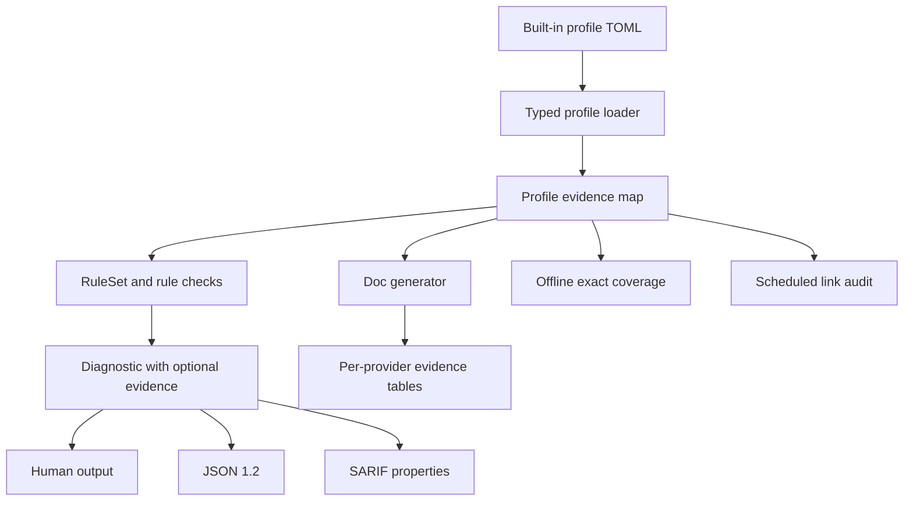

# Provider Rule Source Provenance - Plan

## Goal Capsule

**Objective.** Every built-in provider rule tells users what evidence supports it without presenting Schemalint's own documentation as provider proof.

**Means.** Store typed, provider-specific evidence on profiles, attach it to emitted diagnostics, and generate provider evidence tables from the same data (KTD1, KTD2).

**Authority.** Product Requirements govern behavior. Key Technical Decisions govern mechanism within their cited requirements. Official provider documentation governs `documented` claims; live verification or explicit inference labels govern everything else.

**Execution profile.** Implement and verify in dependency order. Keep custom profiles backward compatible and normal builds offline.

**Stop conditions.** Stop if a built-in provider-rule instance cannot be classified honestly, an official source no longer supports a `documented` claim, or a public output change cannot be represented compatibly under the chosen version contract.

**Tail ownership.** The implementer runs every Verification Contract gate, reviews generated rule-page changes, and leaves the branch ready for review without merging it.

---

## Product Contract

### Summary

Schemalint diagnostics already link to a local rule explanation. Add a separate provider-evidence surface that names whether the rule is documented, supported by an example or SDK transformation, live-verified, inferred, or unknown, and links directly to the canonical provider section when one exists.

### Problem Frame

The current `see` link explains Schemalint's rule but does not show the provider statement behind it. The dormant flat `RuleMetadata::see_also` field cannot solve that honestly because one generated page can represent multiple providers with different evidence, and some active rules are intentionally inferred or undocumented.

The repository currently generates 46 rule pages representing 67 active provider-rule instances. OpenAI directly documents rules such as all-fields-required and schema budgets, while other OpenAI and Anthropic classifications rely on absence from a supported list, SDK transformation behavior, live checks, or fail-closed inference. A URL-only design would erase those distinctions.

### Key Decisions

- **Provider evidence remains separate from Schemalint help.** The existing local `see`, `seeUrl`, and SARIF `helpUri` contracts remain intact; provider evidence is additive. Governs R3, R4, R5. (session-settled: user-approved — chosen over replacing local rule links with provider links: users need both the actionable Schemalint explanation and the original authority.)
- **Every built-in active provider rule has an explicit evidence classification.** Missing evidence is a repository defect, while `unknown` is an intentional and visible state. Governs R1, R2, R6. (session-settled: user-approved — chosen over treating every source URL as direct proof: several existing rules are inferred or undocumented.)
- **Network checks are operational, not build inputs.** Required CI validates evidence completeness and generated output without fetching the internet; a scheduled/manual audit checks live URLs. Governs R7, R8. (session-settled: user-approved — chosen over network-dependent normal builds: provider availability must not make ordinary tests flaky.)

### Requirements

**Evidence model and coverage**

- R1. Each active rule instance in each built-in profile resolves to exactly one provider-evidence bundle keyed by a canonical, provider-independent rule identity.
- R2. An evidence bundle declares one of `documented`, `documented_example`, `sdk_transform`, `live_verified`, `inferred`, or `unknown`; status-specific validation prevents stronger claims than the stored evidence supports.
- R3. The human diagnostic retains its local `see` line and adds one compact provider-evidence line. Direct evidence links to the canonical provider section; indirect or unknown evidence is visibly labeled and never invents a provider URL.
- R4. JSON diagnostics retain `seeUrl`, add a typed `providerEvidence` object, and advance the output schema version to `1.2` so machine consumers can detect the additive contract.
- R5. SARIF retains each rule's local `helpUri` and exposes provider evidence through the reporting descriptor's `properties` extension without replacing standard fields.
- R6. Generated rule pages show deterministic evidence rows per applicable profile: provider code, evidence status, canonical source when present, and concise basis. A non-applicable provider is not rendered as `unknown`.

**Validation and maintenance**

- R7. Required offline tests reject missing, duplicate, malformed, or orphaned evidence for built-in profiles and detect conflicts in provider-neutral metadata during doc generation.
- R8. A scheduled and manually dispatchable workflow validates evidence URLs, follows redirects, reports canonical drift and lost fragments, retries transient failures, and distinguishes inconclusive network responses from confirmed broken links.
- R9. Existing third-party profile files without evidence continue to load. Repository completeness enforcement applies to built-ins; a custom profile diagnostic without evidence simply omits the provider-evidence field and line.

### Acceptance Examples

- AE1. Given `OAI-S-all-properties-required`, human output retains the Schemalint `see` URL and adds the OpenAI `#all-fields-must-be-required` URL labeled `documented`.
- AE2. Given an inferred Anthropic rule, generated docs label it `inferred`, show its rationale and any adjacent official source, and do not claim that Anthropic directly documents the rule.
- AE3. Given a newly enabled built-in structural rule with no evidence record, an offline coverage test fails and names the profile plus canonical rule identity.
- AE4. Given a custom profile using the existing TOML format, loading and linting remain successful and no fabricated `unknown` evidence is emitted.
- AE5. Given a canonical provider URL that redirects to a new official page, the scheduled audit reports canonical drift; a transient 429 or 5xx retry exhaustion is reported as inconclusive rather than proof that the rule is wrong.

### Scope Boundaries

- This work records provenance for the current OpenAI and Anthropic built-in profiles; it does not change rule severity or provider behavior.
- This work does not scrape provider documentation or derive evidence automatically from rule names.
- GHA and JUnit remain concise execution/reporting formats and do not gain provider-evidence payloads in this change.
- Custom profiles may opt into evidence later, but completeness is not a new load-time compatibility requirement for them.

### Success Criteria

- All 67 current built-in provider-rule instances have explicit, reviewable evidence bundles.
- The emitted source link for OpenAI's all-fields-required diagnostic opens the exact official section.
- Generated documentation, JSON snapshots, and SARIF snapshots prove provider evidence survives each supported surface without replacing local help links.
- Normal workspace tests need no network access.

---

## Planning Contract

### Key Technical Decisions

- KTD1. **Profile-owned typed evidence.** Extend `Profile` with provider evidence keyed by a new `RuleKey` domain type. Reuse `Keyword` and `StructuralRuleId`; add only the semantic identity needed for universal rules. This keeps shared rule implementations provider-agnostic and gives both dynamic and static rules the existing `&Profile` lookup seam. Governs R1, R2, R7, R9.
- KTD2. **One evidence bundle, multiple ordered sources.** A provider-rule pair owns one status and may cite multiple sources. Source records carry a canonical HTTPS URL plus optional fragment and title; non-direct statuses require a concise basis, `live_verified` also requires a verification date and target, and `unknown` requires a basis but no URL. Governs R1, R2, R6.

  | Status | Sources | Basis | Verification date + target | Rendering claim |
  |---|---|---|---|---|
  | `documented` | One or more required | Optional | Forbidden | Provider documentation directly states the constraint. |
  | `documented_example` | One or more required | Required | Forbidden | Provider documentation demonstrates the behavior but does not state it normatively. |
  | `sdk_transform` | One or more required | Required | Forbidden | Official SDK documentation or source states the transformation; it is not presented as a provider-schema constraint. |
  | `live_verified` | Optional and adjacent only | Required | Required | A dated provider/model probe observed the behavior; linked documentation is supporting context only. |
  | `inferred` | Optional and adjacent only | Required | Forbidden | Schemalint infers the constraint; linked documentation is supporting context only. |
  | `unknown` | Forbidden | Required | Forbidden | No supporting provider source is known. |

  When evidence could fit more than one row, use the weakest claim that the stored record proves: `documented` only for normative text, then `documented_example` or `sdk_transform` for their exact source kinds, then `live_verified`, `inferred`, and `unknown`.
- KTD3. **Resolve evidence when constructing diagnostics.** Rules attach the matching optional evidence bundle to `Diagnostic`; every emitter consumes that same value. Avoid separate code-to-source joins in individual emitters. Governs R3, R4, R5.
- KTD4. **Public output changes are explicit.** JSON advances from schema `1.1` to `1.2`. SARIF uses `tool.driver.rules[].properties.providerEvidence`, keyed by the already provider-expanded rule ID, while keeping `helpUri`. Governs R4, R5.
- KTD5. **Exact built-in coverage, compatible custom profiles.** Construct each built-in `RuleSet`, enumerate active provider-rule identities through the same registry path used at runtime, and compare them with profile evidence. Missing, duplicate, inactive, and unknown identities fail deterministic tests; optional evidence on external profiles does not fail loading. Governs R7, R9.
- KTD6. **No third-party link-check dependency.** A small repository script reads the canonical built-in evidence, validates the provider-host allowlist and fragments, and is exercised offline with fixtures. Only the scheduled/manual workflow enables HTTP. Governs R8.

### High-Level Technical Design

Evidence state and rule severity remain independent. `unknown` describes source confidence, not diagnostic severity. Absence means a built-in coverage defect, while a rule not active for a provider is outside that profile's coverage universe.

### Assumptions

- Canonical rule identity uses typed category plus existing rule-domain identifiers rather than expanded diagnostic strings or page slugs.
- Provider evidence is scoped to the full dated profile. A future profile must explicitly reuse or update records rather than inheriting them silently.
- Direct OpenAI anchors and Anthropic's `#json-schema-limitations` anchor remain the initial canonical targets verified on 2026-08-20.

### Sources and Existing Patterns

- `crates/schemalint/src/rules/registry.rs` combines static and profile-generated rules and passes `&Profile` into each check.
- `crates/schemalint/src/profile/structural.rs` already exposes typed `StructuralRuleId` enumeration.
- `crates/schemalint-docgen/src/main.rs` already renders `see_also`, but its deduplication currently retains only later-profile codes rather than provider-specific metadata.
- `docs/solutions/best-practices/schemalint-phase2-learnings.md` requires tests to assert emitted field names and keeps provider identity in profile data.
- [OpenAI Structured Outputs](https://developers.openai.com/api/docs/guides/structured-outputs#supported-schemas) defines the supported subset, required fields, object restrictions, and budgets.
- [Anthropic Structured Outputs](https://platform.claude.com/docs/en/build-with-claude/structured-outputs#json-schema-limitations) defines its supported subset and explicit limitations.

---

## Implementation Units

### U1. Add typed profile evidence and exact coverage

- **Goal:** Establish the canonical evidence model, profile parsing, built-in records, and exhaustive offline coverage before changing output.
- **Requirements:** R1, R2, R7, R9; AE3, AE4; KTD1, KTD2, KTD5.
- **Dependencies:** None.
- **Files:** Modify `crates/schemalint/src/profile/mod.rs`, `crates/schemalint/src/profile/parser.rs`, `crates/schemalint/src/profile/structural.rs`, `crates/schemalint/src/rules/metadata.rs`, `crates/schemalint/src/rules/semantic.rs`, `crates/schemalint/profiles/openai.so.2026-04-30.toml`, `crates/schemalint/profiles/anthropic.so.2026-04-30.toml`, and focused tests under `crates/schemalint/tests/profile_tests/` and `crates/schemalint/tests/rules_tests/metadata.rs`.
- **Approach:** Reserve an optional profile section for evidence, parse canonical rule keys and status-specific records into domain types, populate all built-in active rules, and compare evidence keys against the actual built-in `RuleSet` universe. Keep third-party omission valid.
- **Execution note:** Start with failing parser and exact-coverage tests; evidence completeness is the foundation for every later surface.
- **Patterns to follow:** Typed `Keyword` parsing, `StructuralRuleId::ALL`, fallible `RuleSet::from_profile`, and profile errors that name the invalid field.
- **Test scenarios:**
  1. A representative record for each evidence status parses and round-trips with deterministic source ordering.
  2. Status-specific missing fields fail with precise errors: direct evidence without HTTPS source, inference without basis, live verification without date or target, and unknown with an invented direct URL.
  3. Duplicate keys, unknown canonical identities, and records for inactive rules are rejected by built-in coverage.
  4. Both built-in profiles have an exact evidence-key match with their active rule universe.
  5. A legacy custom profile without the evidence section loads and emits diagnostics with no evidence.
- **Verification:** Focused profile and metadata tests pass; the coverage failure messages identify profile and canonical rule key; no rule severity changes.

### U2. Propagate evidence through diagnostic outputs

- **Goal:** Add provider evidence to human, JSON, and SARIF output while preserving existing Schemalint help links.
- **Requirements:** R3, R4, R5; AE1; KTD3, KTD4.
- **Dependencies:** U1.
- **Files:** Modify `crates/schemalint/src/rules/registry.rs`, dynamic/static rule constructors under `crates/schemalint/src/rules/`, `crates/schemalint/src/cli/emit_human.rs`, `crates/schemalint/src/cli/emit_json.rs`, `crates/schemalint/src/cli/emit_sarif.rs`, and relevant integration, node, server, and snapshot tests under `crates/schemalint/tests/`.
- **Approach:** Attach optional evidence at diagnostic construction. Render one compact human line, serialize a typed JSON object under `providerEvidence` with schema version `1.2`, and add the same object to SARIF reporting-descriptor properties. Do not change GHA or JUnit.
- **Patterns to follow:** Existing `Diagnostic` propagation, `seeUrl`, `rule_url`, SARIF `helpUri`, deterministic sorting, and emitter-field assertions from the documented Phase 2 learning.
- **Test scenarios:**
  1. A directly documented OpenAI rule emits both unchanged local help and the exact official anchored source.
  2. An inferred or unknown rule renders a weaker label and basis without fabricating a direct provider claim.
  3. JSON reports schema `1.2`, retains `seeUrl`, and serializes exact public evidence field names.
  4. SARIF retains `helpUri` and places provider evidence under the matching rule descriptor properties.
  5. A custom-profile diagnostic without evidence omits the additive human/JSON/SARIF data cleanly.
- **Verification:** Focused emitter and integration tests pass; reviewed snapshots contain no replaced local links and no ambiguous evidence labels.

### U3. Generate provider evidence on every rule page

- **Goal:** Make generated documentation the full provenance explanation for shared and provider-specific rules.
- **Requirements:** R6, R7; AE2; KTD2.
- **Dependencies:** U1.
- **Files:** Modify `crates/schemalint-docgen/src/main.rs`, add focused docgen tests in `crates/schemalint-docgen/src/main.rs` or a small adjacent test module, and regenerate `docs/docs/rules/`.
- **Approach:** Accumulate provider codes and evidence in sorted provider-keyed maps, fail deterministically when supposedly provider-neutral metadata conflicts, and render an evidence table that distinguishes direct links, adjacent evidence, live verification, inference, and unknown status.
- **Patterns to follow:** Current `DedupedRule` collection, generated-doc staleness gates in `.github/workflows/ci.yml` and `.github/workflows/docs.yml`, and ordinary Markdown links.
- **Test scenarios:**
  1. A rule shared by OpenAI and Anthropic retains both evidence bundles after deduplication.
  2. A provider-specific rule renders only its applicable provider and never an `unknown` row for the other.
  3. Conflicting shared description, category, or examples fail generation rather than using first-profile-wins behavior.
  4. Generated pages contain canonical source anchors and stable profile/status ordering.
- **Verification:** Docgen tests pass; regeneration produces all expected pages; a second regeneration leaves no diff.

### U4. Audit canonical provider links outside normal CI

- **Goal:** Detect source drift without making ordinary builds depend on provider availability.
- **Requirements:** R8; AE5; KTD6.
- **Dependencies:** U1.
- **Files:** Add a focused script under `scripts/validation/`, its offline tests or fixtures under the same validation area, and a scheduled/manual workflow under `.github/workflows/`.
- **Approach:** Extract URL-bearing built-in evidence through a machine-readable local command or deterministic profile reader, enforce official-host HTTPS URLs offline, and enable HTTP only in a weekly UTC schedule and `workflow_dispatch`. Follow redirects, compare final canonical locations, verify fragments where fetchable, retry 429/5xx, and report 401/403/timeouts as inconclusive.
- **Execution note:** Prove extraction and classification with local fixtures before enabling the workflow's network mode.
- **Patterns to follow:** Existing validation scripts and workflows; avoid a new dependency when standard tooling is sufficient.
- **Test scenarios:**
  1. Offline mode rejects non-HTTPS and non-provider hosts without making a request.
  2. Fixture responses distinguish valid, canonical redirect drift, missing fragment, confirmed 4xx, transient retry, and inconclusive access denial.
  3. The workflow has both weekly schedule and manual dispatch and never runs as a required pull-request gate.
- **Verification:** Offline script checks pass; workflow syntax is valid; no normal Cargo test or required CI job performs network I/O.

---

## Risks and Dependencies

- Provider pages and anchors can move. Store canonical URLs, make drift visible, and keep the Schemalint rule page as the durable local explanation.
- Adding evidence to every diagnostic increases cloning and output size. The records are small; avoid new shared-pointer or caching abstractions unless measurement shows a problem.
- JSON `1.2` is an explicit contract change. Update every in-repo consumer assertion and snapshot, but do not silently rewrite regression corpus `.expected` files.
- A profile comment is not executable provenance. During U1, every current comment must be translated carefully and reviewed against the cited provider source or an honest non-direct status.

---

## Verification Contract

| Gate | Applies to | Done signal |
|---|---|---|
| Focused profile and rule metadata tests | U1 | Both built-ins have exact evidence coverage; invalid and custom-profile cases behave as specified. |
| Focused emitter, snapshot, integration, node, and server tests | U2 | Human, JSON 1.2, and SARIF contracts preserve local help and expose typed evidence. |
| Docgen tests plus two consecutive generations | U3 | Provider evidence survives deduplication and generated docs are stable. |
| Offline link-audit fixtures and workflow validation | U4 | URL policy and response classification are deterministic; network mode is scheduled/manual only. |
| `cargo fmt --all -- --check` | All | Formatting is clean. |
| `cargo clippy --workspace -- -D warnings` | All | No warnings. |
| `cargo test --workspace` | All | Full Rust workspace passes. |
| `cargo build --workspace` | All | All crates build. |
| `cargo bench --no-run --workspace` | All | Benchmark targets compile. |
| Generated documentation diff gate | U1-U3 | `cargo run --bin schemalint-docgen` leaves no unexplained diff. |

---

## Definition of Done

- Every requirement R1-R9 and acceptance example AE1-AE5 is covered by an implementation unit and passing evidence.
- All current built-in provider-rule instances have one explicit evidence bundle and no orphaned records exist.
- Human, JSON, SARIF, and generated docs preserve local Schemalint help while exposing honest provider provenance.
- Custom profiles without provenance remain compatible.
- Required verification is offline; scheduled/manual link auditing reports drift and transient failures distinctly.
- Generated docs and public output snapshots are reviewed intentionally; regression corpus expectations are unchanged unless separately justified.
- All workspace gates pass on the final diff.
- Abandoned experiments, duplicate registries, temporary files, and dead code are absent from the final branch.
